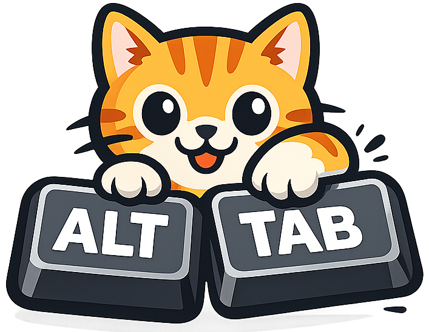

# Alt-Tabby

<p align="center">
  
</p>

A fast, customizable Alt-Tab replacement for Windows, built with AutoHotkey v2. Designed for power users who want responsive window switching with deep integration for tiling window managers like [Komorebi](https://github.com/LGUG2Z/komorebi).

## Features


- **Low Latency** - Keyboard hooks run in the GUI process for sub-5ms response times
- **MRU Ordering** - Windows sorted by most-recently-used, matching native Windows behavior
- **Komorebi Integration** - Workspace-aware filtering and cross-workspace window activation
- **Workspace Toggle** - Press Ctrl during Alt-Tab to filter by current workspace
- **Configurable** - GUI-based configuration editor with live preview
- **Fullscreen Bypass** - Automatically uses native Alt-Tab in fullscreen games
- **Process Blacklist** - Exclude specific applications from Alt-Tabby
- **Window Blacklist** - Filter out unwanted windows by title or class

## Architecture

Alt-Tabby uses a multi-process architecture for reliability and performance:

```
+------------------+     +------------------+     +------------------+
|    Launcher      |     |   WindowStore    |     |    Alt-Tab GUI   |
|  (Tray + Spawn)  |---->|    (Server)      |<--->|    (Client)      |
+------------------+     +------------------+     +------------------+
                               ^
                               |
                         +-----+-----+
                         |  Viewer   |
                         | (Debug)   |
                         +-----------+
```

### WindowStore (Server)

The store maintains the authoritative window list with real-time updates from multiple producers:

| Producer | Purpose |
|----------|---------|
| WinEventHook | Window create/destroy/focus events (primary) |
| WinEnum | Full window enumeration (on-demand, for Z-order) |
| MRU_Lite | Focus tracking (fallback if WinEventHook fails) |
| KomorebiSub | Workspace tracking via komorebi subscription |
| KomorebiLite | Workspace polling (fallback if subscription fails) |
| IconPump | Async icon extraction |
| ProcPump | Process name resolution |

Clients connect via named pipe (`\\.\pipe\tabby_store_v1`) and receive delta updates.

### Alt-Tab GUI (Client)

The overlay window with keyboard hooks built-in for minimal latency:

- Intercepts Alt+Tab before Windows sees it
- Requests pre-warmed snapshots on Alt press
- Freezes the window list on first Tab press
- Supports quick-switch (Alt+Tab+release before GUI shows)

### Debug Viewer

A diagnostic tool showing the live window list with all fields:

- Toggle between Z-order and MRU sorting
- Filter by current workspace
- Show/hide minimized and cloaked windows
- Double-click to blacklist windows
- Monitor producer health status

## Installation

### Requirements

- Windows 10/11
- [AutoHotkey v2](https://www.autohotkey.com/) (for development)
- Optional: [Komorebi](https://github.com/LGUG2Z/komorebi) for workspace features

### From Release

1. Download `AltTabby.exe` from [Releases](https://github.com/cwilliams5/Alt-Tabby/releases)
2. Run `AltTabby.exe`
3. Right-click the tray icon for options

### From Source

```bash
git clone https://github.com/cwilliams5/Alt-Tabby.git
cd Alt-Tabby

# Run in development mode
AutoHotkey64.exe src/alt_tabby.ahk

# Or compile
compile.bat
```

## Configuration

Access the configuration editor via:
- Tray icon > Config
- Command line: `AltTabby.exe --config`

Key settings:

| Setting | Default | Description |
|---------|---------|-------------|
| GraceMs | 150 | Delay before showing GUI (quick-switch window) |
| FreezeWindowList | false | Lock list on first Tab press |
| BypassFullscreen | true | Use native Alt-Tab in fullscreen apps |
| BypassProcesses | "" | Comma-separated process names to bypass |

Configuration is stored in `config.ini` next to the executable.

## Usage

| Action | Keys |
|--------|------|
| Open Alt-Tab | Alt + Tab |
| Next window | Tab (while holding Alt) |
| Previous window | Shift + Tab |
| Toggle workspace filter | Ctrl (while Alt-Tab is open) |
| Cancel | Escape |
| Switch to selected | Release Alt |

## Documentation

- [IPC Protocol](docs/ipc.md) - Named pipe message schema
- [WindowStore API](docs/windowstore.md) - Store internals and record fields

## Development

### Project Structure

```
src/
  alt_tabby.ahk       # Unified entry point
  gui/                # Alt-Tab overlay
    gui_main.ahk      # Entry, globals, init
    gui_interceptor.ahk # Keyboard hooks
    gui_state.ahk     # State machine
    gui_store.ahk     # Store IPC client
    gui_paint.ahk     # Rendering
  store/              # WindowStore server
    store_server.ahk  # Main process
    windowstore.ahk   # Core API
    winevent_hook.ahk # Window events
    komorebi_sub.ahk  # Komorebi integration
  viewer/             # Debug viewer
  shared/             # IPC, JSON, config
tests/
  run_tests.ahk       # Test orchestrator
  gui_tests.ahk       # State machine tests
```

### Running Tests

```bash
# Unit and integration tests
AutoHotkey64.exe tests/run_tests.ahk --live

# GUI state machine tests
AutoHotkey64.exe tests/gui_tests.ahk
```

### Compiling

```bash
compile.bat
# Output: release/AltTabby.exe
```

## License

MIT

## Acknowledgments

- [Komorebi](https://github.com/LGUG2Z/komorebi) - Tiling window manager for Windows
- [AutoHotkey](https://www.autohotkey.com/) - Scripting language for Windows automation
