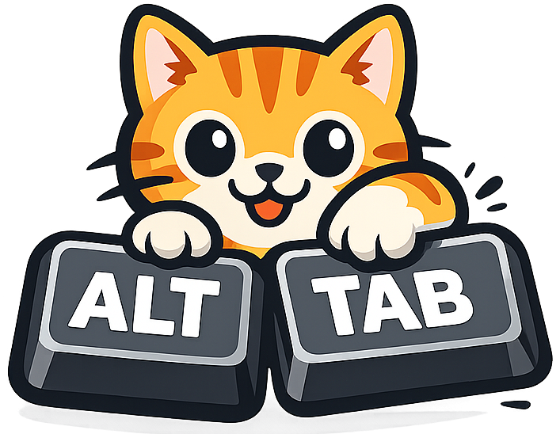

# Alt-Tabby

<p align="center">
  
</p>

<p align="center">
  <a href="docs/what-autohotkey-can-do.md">AHK Deep Dive</a> &nbsp;&middot;&nbsp;
  <a href="docs/llm-development.md">AI-Assisted Development</a>
</p>

<p align="center">
  
  
  
  
  
</p>

A fast, deeply customizable Alt-Tab replacement for Windows. Built with AutoHotkey v2, designed for power users who want responsive window switching, GPU-accelerated visuals, and deep integration with the [Komorebi](https://github.com/LGUG2Z/komorebi) tiling window manager.

<!-- Screenshots/GIFs coming soon -->

## Features


### Window Switching
- **Sub-5ms Detection** — keyboard hooks and window data live in the same process, no IPC on the critical path
- **MRU Ordering** — windows sorted by most-recently-used, matching native Windows behavior
- **Quick Switch** — Alt+Tab and release before the GUI appears for instant window switching (~25ms total)
- **Click or Keyboard** — navigate with Tab/Shift+Tab, arrow keys, or mouse click
- **Row Actions** — hover to reveal close, kill, or blacklist buttons on any window

### Visual Customization
- **GPU-Accelerated Shaders** — up to 4 stackable D3D11 background shader layers with 157 built-in effects (raymarching, fractals, fluid dynamics, domain warping, and more)
- **Mouse-Reactive Effects** — 15 GPU compute shader effects that respond to cursor movement (ember trails, fireflies, fluid simulation, gravity wells, water surfaces, and more)
- **Selection Highlights** — 10 animated shader-based selection effects (aurora, glass, neon, plasma, lightning) or simple color fill
- **Background Images** — load any image with fit modes, blur, desaturation, opacity, and drop shadow
- **Backdrop Materials** — Acrylic blur, Mica, MicaAlt, Aero Glass, or solid color backgrounds
- **Inner Shadow** — recessed glass effect along overlay edges
- **Shader Cycling** — switch background and mouse effects on-the-fly with configurable hotkeys
- **Dark/Light Mode** — follows Windows system theme automatically, or force either mode

### Komorebi Integration
- **Workspace-Aware Filtering** — toggle between all workspaces or current-only with Ctrl during Alt-Tab
- **Cross-Workspace Activation** — select a window on any workspace and Alt-Tabby handles the workspace switch
- **Workspace & Monitor Labels** — optional columns showing which workspace and monitor each window is on

### Window Management
- **Title, Class & Process Blacklist** — filter unwanted windows by pattern (wildcards supported)
- **One-Click Blacklist** — double-click a row or use the action button to blacklist instantly
- **Fullscreen Bypass** — automatically uses native Alt-Tab in fullscreen games
- **Process-Level Bypass** — whitelist specific processes to always use native Alt-Tab
- **Ghost Window Detection** — automatically removes zombie windows from apps that reuse HWNDs

### Configuration
- **350+ Settings** — control every aspect of appearance, behavior, and performance
- **WebView2 Config Editor** — modern web-based UI with sections, search, and live validation
- **Native AHK Fallback** — pure AutoHotkey editor for systems without WebView2
- **Portable** — single `config.ini` file next to the executable, no registry entries

### Installation & Updates
- **First-Run Wizard** — interactive setup for Start Menu, startup, Program Files install, and admin mode
- **Auto-Update** — checks for new releases on startup with one-click apply
- **Admin Mode** — optional Task Scheduler integration for UAC-free elevated operation
- **Portable Executable** — single `.exe`, no installer, no external dependencies

### Diagnostics
- **Flight Recorder** — always-on in-memory event ring buffer (~1 microsecond/event, zero allocations). Press F12 to dump a full state snapshot with event trace.
- **Debug Viewer** — live window list inspector with Z-order/MRU sorting, workspace filtering, and producer health monitoring
- **15+ Diagnostic Logs** — selective logging for keyboard events, focus tracking, paint timing, shader compilation, IPC, and more
- **Usage Statistics** — optional lifetime and session stats (Alt-Tabs/hour, quick switch rate, peak windows tracked)

### Performance
- **Adaptive Timer System** — graduated cooldown (8ms active → 100ms idle) with PostMessage hot wakeup for sub-tick IPC latency
- **Multi-Process Architecture** — blocking work (icon extraction, process resolution) runs in a separate subprocess via named pipe IPC
- **Smart Resource Management** — GDI+/D2D resource caching, pre-compiled regex, viewport-based repaint skipping, dirty tracking with field classification
- **Animation Control** — None (zero GPU), Minimal (transitions only), or Full (ambient effects) with configurable FPS cap

## Installation

### Requirements

- Windows 10/11
- [AutoHotkey v2](https://www.autohotkey.com/) (for development only)
- Optional: [Komorebi](https://github.com/LGUG2Z/komorebi) for workspace features

### From Release

1. Download `AltTabby.exe` from [Releases](https://github.com/cwilliams5/Alt-Tabby/releases)
2. Run `AltTabby.exe`
3. Complete the first-run wizard (or skip to use defaults)
4. Right-click the tray icon for options

### From Source

```bash
git clone https://github.com/cwilliams5/Alt-Tabby.git
cd Alt-Tabby

# Run in development mode
AutoHotkey64.exe src/alt_tabby.ahk

# Or compile
compile.bat
# Output: release/AltTabby.exe
```

## Usage

| Action | Keys |
|--------|------|
| Open Alt-Tab | Alt + Tab |
| Next window | Tab (while holding Alt) |
| Previous window | Shift + Tab |
| Toggle workspace filter | Ctrl (while Alt-Tab is open) |
| Cancel | Escape |
| Switch to selected | Release Alt |
| Cycle background shader | Configurable hotkey |
| Cycle mouse effect | Configurable hotkey |
| Dump flight recorder | F12 (configurable) |

## Configuration

Access the configuration editor via:
- Tray icon > Config
- Command line: `AltTabby.exe --config`

Settings are organized into sections:

| Section | What it controls |
|---------|-----------------|
| **AltTab** | Grace period, quick switch, bypass rules |
| **GUI** | Sizing, fonts, colors, effects, columns, scrollbar |
| **Theme** | Dark/light mode, custom color palettes |
| **Shader** | Per-layer shader selection, opacity, speed, darkness |
| **MouseEffect** | Mouse shader, grid quality, particle density, reactivity |
| **BackgroundImage** | Image path, fit mode, blur, desaturation, shadow |
| **Komorebi** | Workspace integration, activation method, timing |
| **Performance** | Process priority, animation mode, FPS, memory policy |
| **Diagnostics** | Flight recorder, logging toggles, stats tracking |
| **Launcher** | Splash screen, editor defaults, debug menu |
| **Setup** | Installation and first-run wizard behavior |
| **Store** | Window store tuning, process resolution, enrichment |
| **IPC** | Named pipe communication parameters |
| **Tools** | External tool paths |
| **Capture** | Screenshot and video capture settings |

Configuration is stored in `config.ini` next to the executable. See [Configuration Options](docs/options.md) for the full reference.

## Documentation

- [Configuration Options](docs/options.md) — all config.ini settings with defaults and ranges
- [Using the Flight Recorder](docs/USING_RECORDER.md) — how to capture and analyze event dumps

## Behind the Scenes

Alt-Tabby is also an experiment in two areas:

**Pushing AutoHotkey.** The rendering stack includes a full D3D11 pipeline with compute shaders, 183 HLSL shaders, zero-copy DXGI surface sharing, DWM compositor integration, and an embedded Chromium control — all from pure AHK v2 via `DllCall` and `ComCall`. Read more: [What AutoHotkey Can Do](docs/what-autohotkey-can-do.md)

**AI-assisted development.** The codebase was built primarily by Claude Code, with 86 static analysis checks, 17 semantic query tools, and an ownership manifest that make categories of mistakes mechanically impossible across sessions. Read more: [Building Alt-Tabby with Claude Code](docs/llm-development.md)

## Development

### Running Tests

```powershell
# Full test suite (static analysis + unit + integration)
.\tests\test.ps1 --live
```

### Project Structure

```
src/
  alt_tabby.ahk          # Unified entry point (launcher + all modes)
  gui/                    # MainProcess (overlay, data, hooks, rendering)
  core/                   # Producer modules (WinEventHook, Komorebi, Pumps)
  pump/                   # EnrichmentPump subprocess
  editors/                # Config and blacklist editors
  shared/                 # Window data, IPC, config, blacklist, stats, theme
  shaders/                # HLSL pixel and compute shaders (183 shaders)
tests/                    # Unit, GUI, live tests + 86 static analysis checks
tools/                    # 17 query tools + shader bundler
```

## License

MIT

## Acknowledgments

- [AutoHotkey](https://www.autohotkey.com/) — scripting language for Windows automation
- [LGUG2Z/komorebi](https://github.com/LGUG2Z/komorebi) — tiling window manager for Windows
- [thqby/ahk2_lib](https://github.com/thqby/ahk2_lib) — WebView2, OVERLAPPED (async I/O with MCode trampolines), MCodeLoader, Direct2D, ctypes, Promise, DirectoryWatcher, ComVar
- [G33kDude/cJson.ahk](https://github.com/G33kDude/cJson.ahk) — MCode JSON parser
- [Spawnova/ShinsOverlayClass](https://github.com/Spawnova/ShinsOverlayClass) — Direct2D overlay reference
- [Claude Code](https://claude.ai/claude-code) — AI-assisted development
