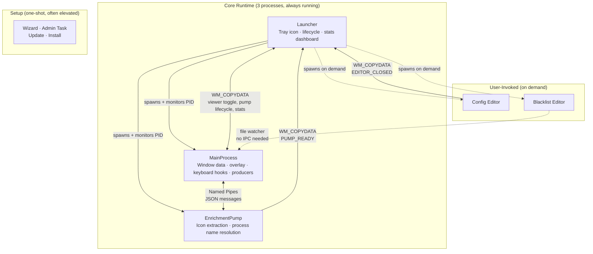

# What AutoHotkey Can Do

People dismiss AutoHotkey as a macro language — good for remapping keys and automating clicks, not for building real software. Alt-Tabby exists partly to challenge that assumption.

This page documents what we built in pure AHK v2 — no C++ shims, no native DLLs beyond what Windows ships. Just `DllCall`, `ComCall`, and a scripting language doing things it wasn't designed for: a D3D11 rendering pipeline with 183 HLSL shaders and GPU compute, a multi-process architecture with named pipe IPC, sub-5ms keyboard hooks with foreground lock bypass via undocumented COM interfaces, embedded Chromium, native dark mode through undocumented uxtheme ordinals, an 86-check static analysis pre-gate, and a build-time profiler that exports industry-standard flamecharts.

> The rendering stack grew organically: GDI+ → Direct2D → D3D11 with HLSL pixel shaders → dedicated swap chain → compute shaders with GPU-side particle state. Each time we expected to hit AHK's ceiling. We haven't yet.

## Contents

- [A Full D3D11 Pipeline](#a-full-d3d11-pipeline) — device creation, shader compilation, bytecode caching, zero-copy DXGI sharing, fullscreen triangle VS
- [Compute Shaders and GPU-Side Particle State](#compute-shaders-and-gpu-side-particle-state) — physics simulation on the GPU
- [The Compositor Stack](#the-compositor-stack) — 8-layer compositing, 183 shaders, iChannel textures, DirectWrite text, DWM integration
- [Multi-Process Architecture](#multi-process-architecture-from-a-single-executable) — 12 runtime modes from one exe, named pipe IPC, WM_COPYDATA signals
- [355 Configurable Settings](#355-configurable-settings) — registry-driven config with live file monitoring
- [Embedding Chromium](#embedding-chromium-webview2) — WebView2 integration with anti-flash and callback stability
- [Native Windows Theming](#native-windows-theming) — 5-layer dark mode API stack, window procedure subclassing, undocumented ordinals
- [Low-Level Keyboard Hooks](#low-level-keyboard-hooks) — sub-5ms detection, STA reentrancy, timer corruption, activation engine, cross-workspace COM uncloaking
- [Escaping the 16ms Timer](#escaping-the-16ms-timer) — QPC spin-waits, NtYieldExecution, graduated cooldowns
- [Portable Executable with Auto-Update](#portable-executable-with-auto-update) — self-replacing exe, state-preserving elevation
- [The Build Pipeline](#the-build-pipeline) — 7-stage smart-skip compilation with shader bundling
- [Test Infrastructure](#test-infrastructure) — 86-check pre-gate, worktree-isolated test suite, dual-gate parallelization
- [Build-Time Profiler](#build-time-profiler-with-flamechart-export) — zero-cost instrumentation with speedscope export
- [Performance Engineering](#performance-engineering) — event pipeline, caching, rendering, frame pacing, MCode
- [The Flight Recorder](#the-flight-recorder) — zero-cost ring buffer diagnostics
- [Video Capture via FFmpeg](#video-capture-via-ffmpeg) — CreateProcess with stdin pipe, GDI+ screenshot export
- [Animated Splash Screen](#animated-splash-screen) — WebP streaming decode with circular ring buffer
- [Crash-Safe Statistics](#crash-safe-statistics) — atomic writes, sentinel-based recovery
- [42,000 Lines of Tooling](#42000-lines-of-tooling) — static analysis, query tools, ownership manifest
- [By the Numbers](#by-the-numbers)

---

## A Full D3D11 Pipeline

Alt-Tabby initializes a Direct3D 11 device, creates shader resources, manages constant buffers, and dispatches GPU work — entirely through AHK's `ComCall` into COM vtable offsets. ([`d2d_shader.ahk`](../src/gui/d2d_shader.ahk))

What that means concretely:

- **Device and context creation** by querying the ID3D11Device from Direct2D's shared device
- **Shader compilation** at runtime via `DllCall("d3dcompiler_47\D3DCompile")` — HLSL source in, DXBC bytecode out
- **Constant buffer management** — a 144-byte cbuffer mapped with `WRITE_DISCARD` every frame, populated with `NumPut` for time, resolution, mouse position, selection geometry, and color data ([`alt_tabby_common.hlsl`](../src/shaders/alt_tabby_common.hlsl))
- **Render target views**, shader resource views, unordered access views — all created and bound through vtable calls
- **Draw and Dispatch calls** for pixel and compute shaders
- **Resource lifecycle** — every COM object reference-counted and released through vtable index 2

The pipeline touches **26 unique COM vtable indices** across device creation, buffer management, shader binding, and draw dispatch. All marshaled through AHK's type system with `"ptr"`, `"uint"`, and `"int"` parameter annotations. A dedicated device abstraction ([`d2d_device.ahk`](../src/gui/d2d_device.ahk)) and type marshaling layer ([`d2d_types.ahk`](../src/gui/d2d_types.ahk)) handle COM interface initialization, device loss recovery, and the raw vtable pointer arithmetic that lets AHK call into DirectX and DXGI without any helper DLLs.

### Bytecode Caching

In development mode, shaders compile from HLSL source at runtime. To avoid recompiling unchanged shaders, each source is MD5-hashed (via Windows CNG: `BCryptOpenAlgorithmProvider` → `BCryptCreateHash` → `BCryptHashData` → `BCryptFinishHash`) and cached as `[16-byte hash][DXBC blob]` on disk. In compiled builds, pre-compiled DXBC bytecode ships as embedded resources — zero compilation overhead at startup.

### Zero-Copy GPU Sharing

The D3D11 render target texture is created with `DXGI_FORMAT_B8G8R8A8_UNORM`. Rather than reading pixels back to the CPU, we `QueryInterface` for `IDXGISurface` and create a D2D bitmap directly from the DXGI surface via `CreateBitmapFromDxgiSurface`. D2D reads GPU memory directly — no staging buffer, no CPU readback, no copy.

### Fullscreen Triangle Vertex Shader

A single vertex shader serves all 183 pixel shaders. It generates a fullscreen triangle from `SV_VertexID` alone — 3 vertices, no vertex buffer, no input layout. UV coordinates are computed in the shader. `Draw(3, 0)` covers every pixel. One VS compiled at init, shared across the entire pipeline.

### DirectComposition Two-Visual Architecture

The overlay window uses a DirectComposition visual tree with a deliberate two-level hierarchy: a parent clip visual and a child content visual. ([`gui_overlay.ahk`](../src/gui/gui_overlay.ahk))

The swap chain is created at the maximum monitor resolution via `IDXGIFactory2::CreateSwapChainForComposition` (vtable 24) and never resized. Window resize and monitor switching don't call `ResizeBuffers` (one of the most expensive DXGI operations) — instead, the parent visual's `SetClip` with a `D2D_RECT_F` dynamically masks the oversized swap chain to the current window bounds. The child visual holds the swap chain content. This means the GPU allocation is fixed at startup, and all "resizing" is just a clip rect update — a near-zero-cost operation.

Frame synchronization uses `IDXGISwapChain2::GetFrameLatencyWaitableObject` (vtable 33), which returns an auto-reset event handle that fires on VSync. `WaitForSingleObjectEx` on this handle replaces manual frame timing with hardware-synchronized rendering.

---

## Compute Shaders and GPU-Side Particle State

Thirteen mouse-reactive effects use D3D11 compute shaders for physics simulation that runs entirely on the GPU:

- **Structured buffers** with 32-byte particle stride (position, velocity, life, size, heat, flags)
- **UAV at register(u0)** written by the compute shader, **SRV at register(t4)** read by the pixel shader
- **Dispatch with 64 threads per group**, thread count computed from particle buffer size
- **Configurable grid quality** (512×256 up to 2048×1024) and particle density

The compute shader updates particle state (physics, spawning, death) while the pixel shader reads the results and renders. State persists across frames on the GPU — AHK never touches individual particles after initialization.

Buffer initialization uses an exponential doubling pattern (`RtlCopyMemory` doubling the filled region each pass) to initialize thousands of dead particles in O(log N) DllCalls instead of per-element `NumPut` loops.

Each compute shader is driven by a JSON metadata file declaring `maxParticles`, `particleStride`, and `baseParticles`. The bundler reads these to configure buffer allocation at load time — grid dimensions scale with a quality preset (512×256 to 2048×1024), and particle counts scale with a density multiplier. This means adding a new compute shader effect requires zero AHK code changes: write the HLSL, write the JSON, and the pipeline discovers and configures it automatically.

**Effects built on this pipeline:** particle systems (ember trails, campfire embers, smoke, fireflies, scatter, neon trails, long-range embers), fluid simulation (aquarium, calm fluid, emitters), and surface physics (gravity wells, water surfaces, ripples). Two additional mouse effects (caustics, spotlight) are pixel-only — no compute shader needed.

---

## The Compositor Stack

Every frame composites up to 9 layers, bottom to top: ([`gui_effects.ahk`](../src/gui/gui_effects.ahk))

1. **DWM Surface** — the desktop backdrop, untouched
2. **User Background Image** — any PNG/JPG, with fit modes (fill, contain, stretch, tile), blur, desaturation, opacity
3. **Shader Layers 1–4** — stackable D3D11 pixel shaders, each with independent opacity, darkness, desaturation, and speed controls
4. **Mouse Effect** — a compute+pixel shader pair tracking cursor position and velocity in real-time
5. **Selection/Hover Highlight** — shader-based animated highlight (aurora, glass, neon, plasma, lightning, and more) or simple D2D fill
6. **Inner Shadow** — D2D1 effect chain (Flood → Crop → GaussianBlur) for recessed-glass depth
7. **Text Rendering** — window titles, subtitles, column data, with optional soft drop shadows via separate blur effect
8. **Action Buttons** — close/kill/blacklist buttons rendered on hover

All of this runs at the monitor's native refresh rate. The shader pipeline supports time accumulation (animation state persists across overlay show/hide), per-shader time tracking (no cross-shader pollution), and entrance animations synchronized across layers. An animation framework ([`gui_animation.ahk`](../src/gui/gui_animation.ahk)) coordinates synchronized entrance transitions across all compositor layers — fading, scaling, and sliding in concert so the overlay appears as a single cohesive surface rather than independent layers popping in.

Behind the compositor sits a live data layer ([`gui_data.ahk`](../src/gui/gui_data.ahk)) that manages display list refresh, pre-caching during Alt key press, and safe eviction of destroyed windows during the ACTIVE state — all performance-critical paths that ensure the compositor always has fresh, consistent data to render.

The display list uses a three-array freeze design to balance structural stability with cosmetic freshness during Alt-Tab. `gGUI_LiveItems` is always fresh from the window store (canonical). When Tab is first pressed, `gGUI_ToggleBase` captures a shallow clone (frozen for workspace toggle support). `gGUI_DisplayItems` is the filtered view from ToggleBase — what actually renders. Crucially, these are *references* to live store records, not copies. Structure is frozen (no additions, no reorders), but cosmetic fields (title, icon, processName) flow through live — so if an icon resolves mid-Alt-Tab, it appears immediately without rebuilding anything. Window destroys are allowed through (they're signal, not noise), and selection tracking adjusts automatically when a destroyed window is evicted.

### Soft Rectangle Primitives

Inner shadows and glow effects are built from D2D1 effect chains wired entirely through `ComCall`: Flood (solid color) → Crop (rect bounds) → GaussianBlur. ([`gui_effects.ahk`](../src/gui/gui_effects.ahk))

This produces soft-edged colored rectangles without intermediate bitmaps or CPU-side image processing. Two independent chains run simultaneously for top and bottom inner shadows — avoiding reconfiguration of a single chain mid-frame. Each chain's properties (ARGB, rect, blur radius) are tracked in static locals; `SetFloat`/`SetColorF`/`SetRectF` COM calls are skipped when values haven't changed, eliminating redundant GPU state updates for config-stable effects. A CPU-side HDR gamma correction step applies a power curve to flood colors *before* they enter the blur chain, avoiding the premultiplied-alpha edge artifacts that occur when gamma is applied after GaussianBlur.

### Offscreen Render-to-Texture

The background image layer (PNG/JPG with fit modes, blur, desaturation) is pre-rendered once into an offscreen D2D bitmap and cached. ([`gui_bgimage.ahk`](../src/gui/gui_bgimage.ahk))

`ID2D1DeviceContext::SetTarget` redirects D2D drawing to a target-capable bitmap (created with the `D2D1_BITMAP_OPTIONS_TARGET` flag and premultiplied alpha). The background image is composited with its effects — four fit modes (Fill, Fit, Stretch, Fixed), nine alignment points, configurable interpolation (Nearest/Linear/HighQualityCubic), and optional blur/desaturation — into this offscreen surface. The hot path draws a single `DrawBitmap` per frame. Tile mode creates a `D2D1_BITMAP_BRUSH` with WRAP extend modes, cached on config change.

### DirectWrite Text Layout

Text rendering uses DirectWrite via D2D with character-granularity ellipsis trimming (`DWRITE_TRIMMING_GRANULARITY_CHARACTER`) for clean text overflow. Text formats are cached per DPI scale, and an alignment state tracker skips redundant `SetTextAlignment` COM calls when alignment hasn't changed between consecutive draws. Subtitle strings (e.g., "Class: Chrome_WidgetWin_1") are lazily formatted once per display cycle and cached by hwnd — avoiding string concatenation on every paint frame for windows without resolved process names. ([`gui_gdip.ahk`](../src/gui/gui_gdip.ahk))

### 183 Shaders

The shader library includes 157 background shaders (raymarching, domain warping, fractals, fluid dynamics, matrix effects, aurora, and dozens more), 15 mouse-reactive shaders (particle systems, fluid simulations, physics effects), and 10 selection highlight shaders. Each shader has a JSON metadata file and an HLSL source file. A PowerShell bundling tool ([`shader_bundle.ps1`](../tools/shader_bundle.ps1)) auto-generates the AHK registration code and Ahk2Exe resource embedding directives.

### iChannel Texture System

Shaders can reference external textures (noise patterns, photos, procedural maps) via JSON metadata declaring `iChannels` with a channel index and filename. At load time: GDI+ decodes the PNG/JPG via `GdipCreateBitmapFromFile` → `GdipBitmapLockBits` extracts raw BGRA pixels → `ID3D11Device::CreateTexture2D` creates a GPU texture → `CreateShaderResourceView` makes it bindable → SRVs are bound to pixel shader sampler slots 0–N by channel index. In compiled builds, textures are embedded as resources and extracted to `%TEMP%` at startup. 26 textures across the shader library. Adding a new textured shader requires zero AHK code changes — just reference the file in the JSON metadata. ([`d2d_shader.ahk`](../src/gui/d2d_shader.ahk))

### DWM Composition

Alt-Tabby uses undocumented and semi-documented Windows DWM APIs for native desktop integration:

- **Acrylic blur** via `SetWindowCompositionAttribute` (undocumented user32 API) — blurred translucent backdrop with tint color
- **Mica and MicaAlt materials** via `DwmSetWindowAttribute` with `DWMWA_SYSTEMBACKDROP_TYPE` (Windows 11). DWM Mica requires `WS_CAPTION` on a non-ToolWindow — but ToolWindow is needed to suppress the taskbar entry. Solution: a hidden owner window (owned windows skip the taskbar), with `WS_SYSMENU | MINIMIZEBOX | MAXIMIZEBOX` stripped and a `WM_NCCALCSIZE` handler that zeros the non-client area to hide the title bar. The result: full Mica material with no visible chrome and no taskbar entry. `DwmExtendFrameIntoClientArea` extends the DWM frame for transparent D2D rendering on top. ([`gui_overlay.ahk`](../src/gui/gui_overlay.ahk))
- **Window cloaking** via `DWMWA_CLOAK` for zero-flash show/hide
- **Rounded corners** via `DWMWA_WINDOW_CORNER_PREFERENCE`
- **DwmFlush** for compositor synchronization after render target updates
- **Dark mode** — see [Native Windows Theming](#native-windows-theming) below

---

## Multi-Process Architecture from a Single Executable

One compiled `AltTabby.exe` serves 12 different runtime modes, selected by command-line flags. Three processes run continuously, editors launch on demand, and setup modes are one-shot tasks that often require elevation. ([`alt_tabby.ahk`](../src/alt_tabby.ahk))



The launcher is the lifecycle hub — it spawns the GUI and pump as child processes, monitors their PIDs, and handles recovery (if the pump crashes, the GUI reports via `WM_COPYDATA` and the launcher restarts it). The heavy IPC path is the named pipe between MainProcess and EnrichmentPump: UTF-8 JSON messages carrying icon and process enrichment requests. Everything else — viewer toggling, stats queries, editor lifecycle — flows through lightweight `WM_COPYDATA` signals, which piggyback on the Windows message loop AHK already runs (zero additional infrastructure). The named pipe exists because icon extraction and process name resolution block (50–100ms per call), and that latency can't live on the GUI thread. Config and blacklist changes bypass IPC entirely via file watchers in the GUI process.

The runtime mode is selected by command-line flag:

| Flag | Role |
|------|------|
| *(none)* | Launcher — tray icon, subprocess management, lifecycle |
| `--gui-only` | MainProcess — window data, producers, overlay, keyboard hooks |
| `--pump` | EnrichmentPump — blocking icon/process resolution |
| `--config` | Configuration editor (WebView2 or native AHK) |
| `--blacklist` | Blacklist editor |
| `--wizard-continue` | First-run setup (post-elevation) |
| `--enable-admin-task` | Task Scheduler task creation (post-elevation) |
| `--apply-update` | Update application (post-elevation) |
| `--update-installed` | Update installed copy (post-elevation) |
| `--repair-admin-task` | Repair stale admin task (post-elevation) |
| `--disable-admin-task` | Delete admin task (post-elevation) |
| `--install-to-pf` | Install to Program Files (post-elevation) |

The mode flag is checked before `#Include` directives execute, so each mode only initializes the code paths it needs.

### Event-Driven Producer Architecture

The MainProcess runs 8 independent data producers in `src/core/`, each responsible for a different source of window information:

| Producer | Role | Trigger |
|----------|------|---------|
| **WinEventHook** | Focus, show/hide, title changes, MRU ordering | Kernel callbacks via `SetWinEventHook` |
| **Komorebi Sub** | Workspace assignments, focused window per workspace | Named pipe subscription |
| **Komorebi State** | Full workspace state reconciliation | On-demand polling |
| **WinEnum** | Complete window discovery | Startup, snapshot requests |
| **MRU Lite** | MRU fallback if WinEventHook fails | Timer-based polling |
| **IconPump** | Icon resolution (via EnrichmentPump subprocess) | Pipe IPC responses |
| **ProcPump** | Process name resolution (via EnrichmentPump subprocess) | Pipe IPC responses |

Producers are fault-isolated — if one fails at startup, the others continue. All write to a shared store through `WL_UpsertWindow()` and `WL_UpdateFields()`, with dirty tracking that classifies changes by impact (MRU-only, structural, cosmetic) to minimize downstream work. Because producers are eventually-consistent, the refresh path includes a foreground guard: at Alt press, `GetForegroundWindow()` is checked directly — if that hwnd isn't in the display list yet (race between `EVENT_SYSTEM_FOREGROUND` and WinEnum discovery), it's probed, upserted with current MRU data, and placed at position 1. This guarantees the currently-focused window always appears at the top.

### Named Pipe IPC

The EnrichmentPump runs in a separate process to keep blocking Win32 calls (icon extraction, process name resolution) off the GUI thread. Communication happens over named pipes, built entirely from Win32 API calls: ([`ipc_pipe.ahk`](../src/shared/ipc_pipe.ahk))

- **Server:** `CreateNamedPipeW` with `PIPE_TYPE_MESSAGE | FILE_FLAG_OVERLAPPED`, `CreateEventW` for async connect detection, `WaitForSingleObject` for connection polling
- **Client:** `CreateFileW` with `GENERIC_READ|WRITE`, `WaitNamedPipeW` for server availability with exponential backoff
- **Read/Write:** `ReadFile`, `WriteFile`, `PeekNamedPipe` for non-blocking data availability checks
- **Security:** `InitializeSecurityDescriptor` + `SetSecurityDescriptorDacl` with NULL DACL so non-elevated clients can connect to an elevated server
- **Protocol:** UTF-8 JSON lines over message-mode pipes

The pipe wakeup pattern uses `PostMessageW` after writes to signal the receiver immediately instead of waiting for its next timer tick. Combined with graduated timer cooldown (8ms active → 20ms → 50ms → 100ms idle), the system is responsive under load and silent when idle.

### Async I/O via Thread Pool Completion

The komorebi subscription engine eliminates timer-based polling entirely using Windows I/O completion ports. `BindIoCompletionCallback` binds the named pipe handle to the OS thread pool; when data arrives, a 52-byte x86-64 MCode trampoline ([`OVERLAPPED.ahk`](../src/lib/OVERLAPPED.ahk)) marshals the completion back into AHK's GUI thread via `SendMessageW`. The result: zero CPU when idle, instant wake on data — no 8ms timer tick to wait for. If async binding fails on a given handle, the system falls back gracefully to legacy timer-based polling, and a 2-second maintenance timer can promote back to async mode at runtime.

### Cross-Process Icon Handle Sharing

Icon resolution is expensive (50–100ms per window, blocking). The EnrichmentPump resolves icons in its own process, but rather than serializing pixel data over IPC, it sends the raw `HICON` handle as a JSON integer. This works because `HICON` handles are kernel-wide USER objects in `win32k.sys` shared memory — a handle resolved in one process is valid in any other process in the same session. The GUI process receives the numeric handle and uses it immediately for D2D rendering. Per-EXE master icon caching deduplicates across windows from the same application, and per-window no-change detection (comparing raw handle values) skips redundant updates.

---

## 355 Configurable Settings

The entire application is driven by a centralized config registry (`config_registry.ahk`) with 355 settings across 15 sections. Each entry declares its type, default, min/max bounds, and description. Validation, documentation generation, and editor UI are all registry-driven — adding a setting to one file propagates everywhere automatically.

Both `config.ini` and `blacklist.txt` are live-monitored via `ReadDirectoryChangesW` with 300ms debounce. Edit either file in Notepad, save, and the app picks up the change — config changes trigger a full restart through the launcher, blacklist changes hot-reload the eligibility rules in-process. This also means `git checkout` of a different config branch just works.

---

## Embedding Chromium (WebView2)

The configuration editor embeds a full Chromium instance via Microsoft's WebView2 control, using [thqby's WebView2.ahk](https://github.com/thqby/ahk2_lib) wrapper for the COM interop. The wrapper handles the WebView2 lifecycle — but integrating it into a production application required solving several AHK-specific problems: ([`config_editor_webview.ahk`](../src/editors/config_editor_webview.ahk))

```
AHK GUI Window
  └─ WebView2 Control (Chromium renderer)
       └─ HTML/CSS/JS configuration UI
            ↕ postMessage / WebMessageReceived
       AHK event handlers
```

- **Anti-flash:** WebView2 crashes if the hosting window is DWM-cloaked during initialization (it needs compositor access). Solution: a three-phase dance — start off-screen at alpha 0, uncloak for WebView2 init, re-cloak after navigation completes, center the window while invisible, set alpha to 255, then uncloak for the reveal. Zero white flash. ([`gui_antiflash.ahk`](../src/shared/gui_antiflash.ahk))
- **Callback stability:** The `WebMessageReceived` handler must be stored in a global variable. If referenced only locally, AHK's garbage collector destroys it while the event subscription is active. Messages silently stop arriving.
- **Callback reentrancy:** Calling `ExecuteScript()` or `GUI.Show()` from inside a `WebMessageReceived` callback permanently corrupts the handler. All heavy work is deferred to a fresh timer thread via `SetTimer(func, -1)`.
- **Resource embedding:** Ahk2Exe's RT_HTML resource type breaks on CSS `%` values (it tries to dereference them). HTML resources use `.txt` extension instead.

The fallback is a pure AHK native editor with sidebar navigation and scroll viewport — no external dependencies.

---

## Native Windows Theming

Alt-Tabby implements the full Windows dark mode API stack — including undocumented APIs that Microsoft ships but doesn't publicly document — from pure AHK v2. ([`theme.ahk`](../src/shared/theme.ahk))

### The Dark Mode API Layers

Windows dark mode isn't a single API call. It's five layers, each targeting a different part of the UI:

1. **`SetPreferredAppMode`** (uxtheme ordinal #135) — tells Windows this process wants dark mode. Must be called before any GUI is created or context menus render light regardless.
2. **`AllowDarkModeForWindow`** (uxtheme ordinal #133) — enables dark mode per-window. Applied to each GUI after construction.
3. **`DwmSetWindowAttribute`** with `DWMWA_USE_IMMERSIVE_DARK_MODE` (attribute 20) — darkens the title bar and window frame.
4. **`SetWindowTheme`** with `"DarkMode_Explorer"` — re-themes individual controls (edit boxes, dropdowns, tree views) to use the dark variant of their visual style.
5. **`WM_CTLCOLOR*` message handlers** — for controls where `SetWindowTheme` isn't enough, custom color handlers return cached GDI brushes for background and text colors.

All five layers are called through `DllCall` — ordinal imports for the undocumented uxtheme functions, standard calls for DWM and user32.

### Beyond Dark Mode

The theming goes deeper than light vs. dark:

- **System theme following** — a `WM_SETTINGCHANGE` listener detects when the user toggles dark/light in Windows Settings and re-themes all windows and controls automatically
- **Force override** — users can force dark or light regardless of system setting
- **User-customizable palettes** — 15+ color slots for each mode (background, text, accent, border, control backgrounds, etc.) all configurable via `config.ini`
- **Win11 title bar customization** — `DwmSetWindowAttribute` with attributes 34 (caption color), 35 (text color), and 36 (border color) for custom-colored title bars, not just dark/light
- **Window materials** — `DWMWA_SYSTEMBACKDROP_TYPE` (attribute 38) for Mica, MicaAlt, and Acrylic backdrop effects on supported Windows 11 builds
- **Rounded corners** — `DWMWA_WINDOW_CORNER_PREFERENCE` (attribute 33) for controlling corner radius on Win11
- **Drop-in dark MsgBox** — `ThemeMsgBox()` replaces the standard `MsgBox` with a fully themed version, used throughout the application for consistent dark mode dialogs

The theme system is shared across all native AHK GUIs (config editor, blacklist editor, wizard, debug viewer). The main overlay is excluded — it has its own ARGB compositor — but every dialog and editor window gets automatic dark mode without per-window effort.

### Window Procedure Subclassing

For controls where `SetWindowTheme("DarkMode_Explorer")` isn't enough, the theme system subclasses window procedures directly from AHK. `GetWindowLongPtrW(..., -4)` retrieves the current window procedure, `SetWindowLongPtrW(..., -4, callback)` installs an AHK callback as the replacement, and `CallWindowProcW()` chains to the original for unhandled messages. This lets AHK intercept `WM_PAINT` and `WM_CTLCOLOR*` at the native level — redirecting paint to apply dark mode text colors and returning cached GDI brushes for control backgrounds. Window procedure subclassing from a scripting language. ([`theme.ahk`](../src/shared/theme.ahk))

### GDI Alpha Compositing for Color Swatches

The native configuration editor includes ARGB color pickers with live alpha-channel preview — rendered through custom GDI compositing in AHK. ([`config_editor_native.ahk`](../src/editors/config_editor_native.ahk))

Each color swatch control is subclassed via `SetWindowSubclass()` with a custom `WM_PAINT` callback. The callback draws a checkerboard background pattern (the universal transparency indicator), then overlays the user's selected color using `AlphaBlend()` with premultiplied ARGB pixel handling. When the config value's max exceeds `0xFFFFFF`, the editor automatically separates the alpha channel into a dedicated percentage slider with a live-updating text label. Hex input, swatch preview, and alpha slider are synchronized through a re-entrancy guard (`hexSyncGuard`) that prevents infinite update loops.

---

## Low-Level Keyboard Hooks

Alt-Tabby intercepts Alt+Tab before Windows processes it. The keyboard hook, window data, and overlay all run in the same process — no IPC on the critical path. ([`gui_interceptor.ahk`](../src/gui/gui_interceptor.ahk))

### Sub-5ms Detection

When Alt is pressed, the hook fires immediately (AHK low-level keyboard hook via `$*` prefix). A 5ms deferred decision window determines whether Tab is part of an Alt+Tab sequence or standalone input. Total detection latency from keypress to state machine transition: under 5ms.

### SetWinEventHook from AHK

Real-time window events (create, destroy, focus, minimize, show, hide, name change) come through `SetWinEventHook` called directly via `DllCall` with a 7-parameter callback created by `CallbackCreate`. Three narrow hook ranges (instead of one wide range) let the Windows kernel skip filtering — only relevant events reach the callback. ([`winevent_hook.ahk`](../src/core/winevent_hook.ahk))

The callback is inline-optimized: event constants are hardcoded as literals instead of global variable lookups, eliminating 10 name resolutions per invocation on a path that fires hundreds of times per second.

### Defense in Depth

Windows silently removes low-level keyboard hooks if a callback takes longer than `LowLevelHooksTimeout` (~300ms). A D2D paint during a Critical section can exceed this. The defense stack:

1. **`SendMode("Event")`** — AHK's default `SendInput` temporarily uninstalls all keyboard hooks. `SendMode("Event")` keeps them active.
2. **`Critical "On"`** in all hotkey callbacks — prevents one callback from interrupting another mid-execution
3. **Physical Alt polling** via `GetAsyncKeyState` — detects lost hooks independent of AHK's hook state
4. **Active-state watchdog** — 500ms safety net catches any stuck ACTIVE state
5. **Event buffering** — keyboard events queue during async operations (workspace switches) instead of being dropped

### STA Message Pump Reentrancy

D2D/DXGI/DWM COM calls pump the STA message loop, dispatching timer callbacks and keyboard hooks *mid-operation*. `BeginDraw`, `EndDraw`, `DrawBitmap`, `SetWindowPos`, `ShowWindow`, `DwmFlush` — any of these can trigger an Alt+Up callback that resets state while the compositor is still drawing. This is AHK's hidden concurrency trap: `Critical "On"` doesn't block COM's internal message pump.

The solution is context-dependent Critical section management. In the hotkey handler (`GUI_OnInterceptorEvent`), Critical stays held for the entire handler — the code has no internal abort points, so interruption corrupts state. In the deferred grace timer (`_GUI_GraceTimerFired`), Critical is released *before* heavy D2D work — safe because the show path has 3 abort points that detect `gGUI_State != "ACTIVE"` and bail. Holding Critical through the 1–2 second first paint would exceed Windows' `LowLevelHooksTimeout` (~300ms), causing silent hook removal. The paint path itself uses a reentrancy guard with `try/finally` to prevent nested paints from STA pump dispatch — without the `finally`, any exception would permanently block all future rendering.

### One-Shot Timer Callback Corruption

Running complex nested call chains (state machine transitions, window activation) inside a one-shot `SetTimer(func, -period)` callback permanently corrupts AHK v2's internal timer dispatch for that function. Future `SetTimer(func, -period)` calls silently fail — forever. Discovered in bug #303.

The fix: defer heavy work to a fresh timer thread via `SetTimer(DoWork.Bind(args), -1)` instead of running inline. The callback returns cleanly, and the deferred work runs in an isolated timer context that can't corrupt the original. This pattern appears throughout the state machine — grace timer recovery, lost-Alt detection, and async activation all use deferred `.Bind()` to avoid the corruption path. Producer error recovery uses the same principle: exponential backoff keeps timers alive (5s → 10s → ... → 300s cap) rather than canceling and recreating them, avoiding the dispatch corruption entirely.

### Window Activation Engine

`SetForegroundWindow` is restricted by Windows security policy — you can't steal focus from another application unless the calling process meets specific criteria. The activation engine ([`gui_activation.ahk`](../src/gui/gui_activation.ahk)) bypasses this with a multi-technique approach borrowed from komorebi's `windows_api.rs`:

1. **Dummy `SendInput` trick** — sends an empty `INPUT_MOUSE` structure (40 bytes of zeros) via `SendInput`. This satisfies Windows' requirement that the calling process has received "recent input" before `SetForegroundWindow` is permitted. No actual mouse movement occurs — it's a zero-op that tricks the foreground lock policy.
2. **TOPMOST/NOTOPMOST Z-order dance** — `SetWindowPos` briefly sets the target window as `HWND_TOPMOST`, then immediately clears it to `HWND_NOTOPMOST`. This forces the window to the top of the Z-order without permanently making it topmost. During overlay fade-out, a simpler `HWND_TOP` is used instead to avoid Z-order flicker.
3. **`SetForegroundWindow` with verification** — the actual focus call, followed by `GetForegroundWindow` to verify it worked (the return value alone isn't reliable).

### Cross-Workspace Activation

Activating a window on a different komorebi workspace adds several layers of complexity:

**Direct komorebi pipe communication** — instead of spawning `komorebic.exe` (50–100ms process creation overhead per call), the engine can send JSON commands directly to komorebi's named pipe at `\\.\pipe\komorebi` via `CreateFileW` + `WriteFile`. Sub-millisecond workspace switches. Controlled by config with transparent CLI fallback.

**Three-strategy workspace confirmation** — after requesting a workspace switch, the engine needs to know when it's complete. Three polling strategies, selectable via config:
- **PollCloak** — queries `DwmGetWindowAttribute(DWMWA_CLOAKED)` on the target window. Sub-microsecond DllCall, lowest latency.
- **AwaitDelta** — reads the current workspace name from the komorebi producer (updated via heartbeat). Zero process spawns.
- **PollKomorebic** — spawns `komorebic query focused-workspace-name` each tick. Most reliable across multi-monitor setups.

**COM-based window uncloaking** — for windows on the current workspace that are DWM-cloaked, the engine walks undocumented Windows shell COM interfaces to uncloak them directly:

1. Create `ImmersiveShell` via undocumented CLSID `{C2F03A33-...}`
2. `QueryInterface` for `IServiceProvider` — raw vtable pointer arithmetic (`NumGet(vtable, 0, "UPtr")`)
3. `QueryService` (vtable index 3) for `IApplicationViewCollection` — tries multiple GUIDs across Windows versions
4. `GetViewForHwnd` to get the `IApplicationView` for the target window
5. `SetCloak(1, 0)` + `SwitchTo()` for uncloak and activation

This is the same COM path that Windows' own Alt+Tab uses internally, accessed entirely through AHK's `DllCall` and manual vtable navigation.

**Per-workspace focus caching** — komorebi workspace switch events are state-inconsistent (the snapshot is taken mid-operation). Rather than trusting the event's `ring.focused` field, the engine maintains a per-workspace cache of the last reliably focused hwnd, populated only from trustworthy events (`FocusChange`, `Show`). During rapid workspace switching, stale `EVENT_SYSTEM_FOREGROUND` events from Windows are suppressed with a 2-second cooldown that auto-expires — never cleared early, because premature clearing during rapid switches caused MRU flip-flop and visible selection jiggle.

**Event buffering with lost-Tab synthesis** — during a workspace switch, `komorebic`'s internal `SendInput` temporarily uninstalls all keyboard hooks (a Windows limitation). If the user presses Tab during this window, the keystroke is lost. The engine detects this pattern — `ALT_DOWN` + `ALT_UP` buffered without any `TAB_STEP` in between — and synthesizes the missing Tab event at the correct position before replaying the buffer.

---

## Escaping the 16ms Timer

AHK's `Sleep` and `SetTimer` have ~16ms resolution (the Windows timer tick). For latency-critical paths, Alt-Tabby uses: ([`timing.ahk`](../src/shared/timing.ahk))

- **QueryPerformanceCounter** via `DllCall` for sub-microsecond timestamps (the `QPC()` function used throughout)
- **Hybrid high-precision sleep** — for durations over 20ms, native `Sleep(ms - 20)` handles the bulk, then a QPC spin-loop with `NtYieldExecution` (to yield CPU timeslices) handles the precise tail
- **Graduated timer cooldown** — IPC pipe timers step through 8ms → 20ms → 50ms → 100ms based on idle streak counters, reactive to activity bursts
- **PostMessage wake** — after pipe writes, `PostMessageW` signals the receiver immediately instead of waiting for the next timer tick

---

## Portable Executable with Auto-Update

A single compiled `.exe` with no installer, no registry entries, no external dependencies:

- **Self-replacing update:** The running exe renames itself to `.old` (Windows allows renaming a running executable), copies the new version to the original path, relaunches, and cleans up `.old` on next startup
- **State-preserving elevation:** When UAC elevation is needed, the current state is serialized to a temp file, the exe relaunches via `*RunAs` with a flag like `--apply-update`, and the elevated instance reads the state file to continue
- **Task Scheduler integration:** Optional admin mode creates a scheduled task (`schtasks`) with `HighestAvailable` run level for UAC-free operation. InstallationId tracking prevents cross-directory task hijacking.
- **Smart compilation:** The build script compares source file timestamps against the compiled exe and skips Ahk2Exe when nothing changed. Resource embedding handles icons, splash images, DXBC shader bytecode, HTML assets, and DLLs.

---

## The Build Pipeline

The compile script ([`compile.ps1`](../tools/compile.ps1)) isn't a thin wrapper around Ahk2Exe. It's a multi-stage build pipeline with smart-skip at every step:

1. **Config documentation generation** — an AHK script reads the config registry and generates `docs/options.md` with all settings, defaults, ranges, and descriptions. Skipped if the output is newer than the registry source.
2. **AGENTS.MD generation** — consolidates `CLAUDE.md` and `.claude/rules/` into a single file for non-Claude AI agents. Smart-skip via timestamp.
3. **Version stamping** — reads the `VERSION` file and generates Ahk2Exe directives for `ProductVersion` and `FileVersion`.
4. **Shader bundling** — discovers all HLSL+JSON pairs in `src/shaders/`, generates `shader_bundle.ahk` (metadata, registration functions, category arrays) and `shader_resources.ahk` (`@Ahk2Exe-AddResource` directives for 183 shaders + 26 textures). Skipped if outputs are newer than all inputs.
5. **Shader compilation** — compiles HLSL sources to DXBC bytecode via `D3DCompile`. Each shader skipped individually if its `.bin` is newer than its `.hlsl` + common header. Stale shaders are partitioned into N chunks (1–8 workers based on CPU count), each worker receiving a manifest file listing its assigned `hlslPath|binPath|entryPoint|target` tuples. N AHK worker processes compile in parallel, with the common header (`alt_tabby_common.hlsl`) auto-injected before each shader source and `#line` directives preserving accurate error line numbers. The aggregator validates DXBC magic bytes (`0x44584243`) on every output `.bin`. A subtle .NET interop fix captures `$proc.Handle` immediately after `Start-Process` — without this, fast-exiting worker processes release their native handle before the exit code can be read, causing silent compilation failures.
6. **Profiler stripping** — copies `src/` to a temp directory and strips every line tagged `;@profile`. The `--profile` flag skips this step for instrumented debug builds. Uses a junction for `resources/` to avoid copying assets.
7. **Ahk2Exe compilation** — compiles the (possibly stripped) source with embedded icon, resources, and version info. Smart-skip if the exe is newer than all source files, resources, and VERSION.

Each step has independent staleness detection. A typical no-change rebuild completes in under a second. The `--force` flag overrides all skips. The `--timing` flag emits machine-readable `TIMING:step:ms` output for CI integration.

The pipeline also handles junction/symlink resolution for process management (finding and killing only *this directory's* AltTabby instances, not the user's personal install or other worktree test processes), and provides detailed error recovery when the exe is locked by a running process.

---

## Test Infrastructure

AHK v2 has no built-in test runner, no assertion library, and no parallel execution. The language's compiler silently accepts code that will fail at runtime — missing `global` declarations create local variables instead, wrong parameter counts go unnoticed, and `Critical "On"` without matching `"Off"` leaks silently. These don't crash; they generate dialog popups that block automated testing or cause silent misbehavior. We built the testing infrastructure from scratch. ([`tests/`](../tests/))

### Static Analysis Pre-Gate

Every test run begins with 86 static analysis checks — PowerShell scripts that scan AHK source for patterns the compiler misses. Bundled into 12 parallel bundles, the pre-gate runs in ~8 seconds and blocks all tests (unit, GUI, and live) if any check fails. New checks are auto-discovered: drop a `check_*.ps1` in the test directory and it's enforced on the next run.

What they catch:

| Category | Checks | Examples |
|----------|--------|----------|
| **Scoping** | `check_globals`, `switch_global` | Missing `global` declarations — AHK silently creates a local instead of accessing the file-scope variable |
| **Concurrency** | `critical_leaks`, `critical_sections`, `critical_heavy_calls`, `callback_critical` | Unmatched `Critical "On"`/`"Off"`, COM calls inside Critical (blocks the STA pump), missing Critical in hotkey callbacks |
| **Functions** | `check_arity`, `check_dead_functions`, `check_undefined_calls`, `duplicate_functions` | Wrong parameter counts, calls to functions that don't exist, dead code |
| **Lifecycle** | `timer_lifecycle`, `destroy_untrack`, `scan_pairing` | Unmatched SetTimer/kill, missing cleanup on window destroy, unbalanced BeginScan/EndScan |
| **Correctness** | `return_paths`, `unreachable_code`, `bare_try`, `numeric_string_comparison` | Functions that fall through without returning, dead code after return, swallowed errors, string-vs-number comparison bugs |
| **Patterns** | `v1_patterns`, `send_patterns`, `map_dot_access`, `dllcall_types` | AHK v1 syntax in a v2 codebase, `SendInput` (uninstalls hooks), dot access on Map objects, wrong DllCall type annotations |
| **Ownership** | `global_ownership`, `function_visibility` | Cross-file mutation of globals not listed in the ownership manifest, calls to `_Private()` functions from other files |
| **Resources** | `dead_globals`, `dead_locals`, `dead_params`, `dead_config`, `lint_ignore_orphans` | Unused variables, config keys defined but never read, stale lint-ignore annotations |
| **Integrity** | `registry_key_uniqueness`, `registry_completeness`, `config_registry_integrity`, `fr_event_coverage` | Duplicate config keys, missing registry fields, flight recorder events defined but never emitted |

### Test Suite

The test harness runs three types of tests in parallel where possible:

- **Unit tests** — production source files are `#Include`'d directly, with mocks for visual/external layers (COM, DllCall, GUI objects). Tests call real production functions, not copies. 25 test files covering store operations, state machine transitions, IPC protocol, blacklist logic, and more.
- **GUI state machine tests** — exercise the full IDLE → ALT_PENDING → ACTIVE state machine with mock rendering, verifying freeze behavior, workspace toggle, escape handling, and config combinations.
- **Live integration tests** — launch the compiled `AltTabby.exe` as a real process, interact via named pipes and WM_COPYDATA, and verify end-to-end behavior including komorebi integration and heartbeat monitoring.

The harness uses poll-based waiting (`WaitForFlag`) instead of fixed sleeps, so tests complete as fast as the system allows. Process launching uses cursor suppression and cleanup utilities. The pre-gate gates *all* test types — static analysis catches AHK coding errors that pass compilation but generate runtime dialog popups, which would break the automated flow for any test running AHK code.

The entire suite is worktree-isolated — multiple agents or users can run tests simultaneously on the same host without interference. Named pipes, mutexes, log files, and process kills are all scoped to the worktree path, so a test run in one git worktree won't collide with another running in the main checkout or a different branch.

Timing instrumentation reports per-check and per-suite durations with bottleneck detection. A dedicated benchmark script measures AHK startup overhead to evaluate parallelization split strategies — because at 12,700 lines of test code, the bottleneck is often process launch time, not test execution.

The `--timing` flag produces a hierarchical timing report showing the two-gate parallelization strategy: Pre-Gate and Compilation run simultaneously, and whichever finishes first unlocks its dependent tests immediately (arrows show which gate released which wave). Truncated example:

```
=== TIMING REPORT ===
                                                    Offset   Duration
----------------------------------------------------------------------
        Phase 1: Pre-Gate + Compilation              +0.2s      10.8s
     ┌─   Compilation                                           10.6s ◄── slowest
     │      Ahk2Exe                                              7.1s ◄── slowest
     │      Profile Strip                                        2.2s
     │      ⋮ (5 more steps)
     │ ┌─  Pre-Gate                                              8.8s
     │ │     check_batch_functions.ps1                            8.5s ◄── slowest
     │ │       check_globals                                     2.3s ◄── slowest
     │ │       check_arity                                       1.2s
     │ │       ⋮ (3 more sub-checks)
     │ │     check_batch_patterns.ps1                             6.4s
     │ │       ⋮ (16 sub-checks)
     │ │     ⋮ (8 more bundles)
     │ │   Phase 2: Tests                            +9.0s      23.5s ◄══ bottleneck
     │ └▸       GUI Tests                            +9.0s       8.0s
     │          Unit/Core/Store                                   7.7s
     │          ⋮ (9 more unit suites)
     └───▸      Live/Watcher                        +10.8s      21.7s ◄── slowest
                Live/Pump                                        19.7s
                ⋮ (4 more live suites)
----------------------------------------------------------------------
Total wall-clock                                                32.5s
```

---

## Build-Time Profiler with Flamechart Export

Alt-Tabby includes a compile-time instrumentation profiler that generates industry-standard flamecharts — with zero cost in production builds. ([`profiler.ahk`](../src/shared/profiler.ahk))

### How It Works

Functions are instrumented with matched `Profiler.Enter()` / `Profiler.Leave()` calls, tagged with a `;@profile` comment:

```ahk
Profiler.Enter("_GUI_PaintOverlay")  ; @profile
; ... rendering work ...
Profiler.Leave()  ; @profile
```

The `compile.ps1` build script strips every line containing `;@profile` from production builds. The profiler code is physically removed from the compiled executable — not disabled, not behind a flag, *gone*. Zero runtime cost, zero binary size cost.

### Recording

In debug builds, the profiler writes QPC timestamps (~100ns precision) into a pre-allocated ring buffer holding the most recent 50,000 events — several minutes of recording at typical call rates. A configurable hotkey toggles recording on/off. No file I/O during recording, no allocations, no measurable impact on the code being profiled.

### Flamechart Visualization

On stop, the profiler exports to [speedscope](https://www.speedscope.app/) JSON format — the same format used by Chrome DevTools, Firefox Profiler, and other industry tools. Open the JSON in speedscope.app (runs entirely in-browser, no upload) and get:

- **Flamecharts** — call stacks over time, showing exactly what ran when and for how long
- **Left-heavy aggregation** — merged call trees showing where cumulative time is spent
- **Sandwich view** — callers and callees of any function

This means you can profile an AHK v2 application with the same tooling used for C++ and JavaScript performance work. The profiler infrastructure (ring buffer, QPC timestamps, speedscope export) is itself written in AHK.

---

## Performance Engineering

Beyond the architecture, specific patterns push AHK's performance across every layer of the stack.

### Event Pipeline

- **Kernel-side event filtering** — three narrow `SetWinEventHook` ranges instead of one wide range (0x0003–0x800C). The Windows kernel skips events that don't match any range entirely — they never reach the AHK callback. On systems with active menus, drag-drop, or selection events, this eliminates thousands of irrelevant dispatches per second.
- **Inlined constants in hot callbacks** — the WinEventHook callback fires hundreds of times per second. Every `global` declaration in AHK costs a name lookup on each invocation. Event codes are hardcoded as integer literals (`0x0003` instead of `EVENT_SYSTEM_FOREGROUND`), eliminating ~10 global name resolutions per callback.
- **Short-circuit no-change updates** — when a focus event fires for the already-focused window, the entire store mutation path is skipped before entering a Critical section. Keyboard-heavy users with focus ping-ponging don't cause useless store operations.
- **Three-layer JSON parsing** for komorebi events — string search for event type → quick extract for specific fields → full JSON parse only when structurally necessary. Avoids parsing 200KB state blobs for the ~80% of events that don't need it.
- **Static array recycling** — hot-path arrays in the WinEventHook batch processor reset with `.Length := 0` (clears data without deallocating backing capacity), then `Push` reuses existing storage. Zero-allocation pattern in a callback firing 100+ times/second.
- **Batch store mutations** — multiple window updates during workspace transitions (cloak/uncloak of 10+ windows) are batched into a single `WL_BatchUpdateFields` call. One store revision bump instead of N, one display list rebuild instead of N.
- **Offset-based line parsing** — IPC message extraction from the pipe buffer tracks a numeric offset instead of slicing the string per-message. `InStr(buf, "\n", , offset)` finds the next delimiter, `SubStr` extracts just that line, and the offset advances. A single `SubStr` at the end removes consumed data. This turns O(N²) per-burst string slicing (where each `SubStr` copies the remaining buffer) into O(N) with one final copy — critical during icon resolution bursts (10+ messages/second).
- **Arithmetic buffer length tracking** — the komorebi subscription engine maintains buffer length as an arithmetic counter (incremented on append, decremented on extraction) instead of calling O(n) `StrLen()` after every read. A safety clamp resyncs via `StrLen` only when the buffer is fully consumed or an error is detected — an edge-case guard, not normal-path overhead.
- **Cloak event batching** — during komorebi workspace switches, 10+ cloak/uncloak events fire in rapid succession. Instead of N individual store mutations, events are buffered into a Map (`hwnd → isCloaked`) and flushed as a single batch update — one revision bump, one display list rebuild instead of N.
- **Exponential backoff with live timers** — when a producer timer hits repeated errors, backoff escalates from 5s → 10s → 20s → ... → 300s cap. Timers are *not* canceled — they continue firing but early-return during cooldown. This avoids one-shot timer dispatch corruption and means recovery is automatic when the underlying issue resolves.

### Display List & Caching

- **Three-path display list cache** — Path 1: cache hit, return cached record references under Critical (~1μs). Path 1.5: only MRU fields changed, move-to-front reorder of the cached array (O(N), ~100μs for 100 windows) instead of full quicksort. Path 3: full filter + sort, only on structural changes. Most frames during Alt-Tab hit Path 1 or 1.5.
- **Dirty tracking with field classification** — global revision counter with fields classified as internal/mruSort/sort/content. Internal changes (icon cooldown, cache metadata) don't bump the revision. MRU-only changes take the fast path. Only structural changes trigger full reprocessing.
- **Incremental MRU sort** — when only one window's MRU timestamp changed, a move-to-front O(N) operation replaces a full quicksort. The quicksort itself uses median-of-3 pivot selection with insertion sort cutoff at partition size 20.
- **Pre-compiled regex** — blacklist wildcard patterns compiled to regex at load time, not per-match

### Rendering Pipeline

- **D2D effect object caching** — COM `GetOutput()` results and D2D1 effect references cached at initialization, eliminating per-frame ComCall overhead. Without caching: ~480 string-keyed Map lookups and ~20 COM method calls per second. With caching: direct pointer access, zero Map lookups in the paint path.
- **Batch cbuffer writes** — D3D11 constant buffer updates consolidated from 35 individual NumPut+ComCall sequences to 3 per shader layer per frame (Map → batch NumPut → Unmap).
- **D3D11 state dirty flag** — shader pipeline tracks whether constant buffer and sampler bindings need re-issuing after D2D's `BeginDraw` (which shares the device context and invalidates D3D11 state). Batch mode defers render target and SRV unbinding between sequential shader passes.
- **Viewport-based repaint skipping** — cosmetic changes to off-screen items (title updates, icon resolution) don't trigger a paint cycle
- **Layout metric caching** — 25+ pre-computed pixel metrics cached per DPI scale, rebuilt only when scale changes (monitor switch, DPI setting change)
- **Static buffer reuse** — `DllCall` marshal buffers declared as `static` in hot-path functions, repopulated via `NumPut` before each call. Zero allocation pressure on GC.
- **D2D geometry caching** — rounded rectangle geometries tracked by 5 static parameters (x, y, w, h, radius). Only recreated on cache miss. Selection rect moves every frame during Alt-Tab but geometry dimensions stay stable across hundreds of frames — skips `CreateRoundedRectangleGeometry` COM call + Release per paint.
- **Exponential doubling for GPU buffer init** — compute shader particle buffers (thousands of elements) initialized via `RtlCopyMemory` doubling: write one template element, then copy 1→2→4→8→... Reduces O(N) individual `NumPut` calls to O(log N) memory copies. Initializing 8192 particles takes ~13 copies instead of 8192 writes.
- **Mouse velocity tracking with exponential smoothing** — frame-to-frame cursor delta is converted to pixels/second, then fed through an exponential smoothing filter for a stable velocity estimate. This smoothed velocity is packed into the shader cbuffer for mouse-reactive effects (particle reactivity, fluid disturbance intensity). The filter prevents abrupt jumps from high-DPI mouse movement or frame timing jitter from propagating as visual noise.
- **DWM geometry nudge** — after a komorebi workspace switch, the DWM backdrop can show stale content from the previous workspace. A ±1px `SetWindowPos` nudge forces DWM to re-sample the desktop composition. The DirectComposition clip rect masks the transient pixel movement — invisible to the user, but enough to trigger a backdrop refresh.
- **DPI-aware resource invalidation** — a `WM_DPICHANGED` (0x02E0) message handler detects monitor DPI changes (moving the window between monitors, or the user changing display scaling). It zeroes `gD2D_ResScale` and `gGdip_ResScale`, forcing D2D text formats, brushes, and layout metrics to recreate on the next paint at the correct scale. Monitor refresh rate is detected via `EnumDisplaySettingsW` with `ENUM_CURRENT_SETTINGS` for frame pacing calibration.
- **Adaptive mouse shader frame skipping** — when a mouse effect exceeds its frame budget, the compositor skips rendering it on the next frame, reusing the cached texture. The rest of the overlay continues at full FPS. This decouples expensive particle/fluid effects from the UI framerate without visible stutter.
- **D2D brush generation counter** — every static brush cache tracks a generation counter. When the D3D11 device is lost (GPU reset, driver update, monitor disconnect), `gD2D_BrushGeneration` increments. On the next paint, stale caches detect the mismatch and recreate their resources. Zero bookkeeping beyond one integer comparison per cache site.
- **Bidirectional resize ordering** — overlay resize has a race between HWND `SetWindowPos` and DirectComposition `Commit`/`Present`. The fix uses direction-dependent ordering: **shrink** calls `SetWindowPos` first (old HWND clips old content cleanly during STA pump), **grow** calls `SetWindowPos` last (old HWND clips new content cleanly). DComp `SetClip + Commit + Present` stay adjacent with no STA pump between, guaranteeing they land on the same compositor frame. Prevents visible background flash artifacts on resize.

### Frame Pacing

- **Three-tier frame pacing** — compositor clock wait for idle (low CPU), waitable swap chain for active rendering (lower latency), QPC spin-wait for final microsecond precision. The system selects the appropriate tier based on overlay state.
- **Compositor clock boost** — `DCompositionBoostCompositorClock` called at show/hide transitions to reduce frame timing jitter during the critical first-paint window.

### Concurrency

- **Adaptive Critical section scoping** — expensive work (icon pre-caching, GDI bitmap operations) runs outside Critical sections using local snapshots of shared state. The snapshot is taken under Critical (~microseconds), then heavy processing runs without blocking the keyboard hook thread. If a reentrant call replaces the global data during processing, the local snapshot remains valid.
- **Display list eviction during ACTIVE** — the frozen display list never grows or reorders during Alt-Tab, but window destroys are allowed through (they're signal, not noise). Selection tracking adjusts automatically when a destroyed window is removed.

### Jumping to Machine Code

When AHK's interpreter isn't fast enough, we drop to native machine code.

The AHK ecosystem has libraries that embed compiled C as base64 MCode blobs — loaded into executable memory via `VirtualProtect(PAGE_EXECUTE_READ)` and called with `DllCall`. Alt-Tabby uses two: [cJson](https://github.com/G33kDude/cJson.ahk) by G33kDude for native-speed JSON parsing, and [OVERLAPPED](https://github.com/thqby/ahk2_lib) by thqby for async I/O with hand-written x86/x64 assembly trampolines that marshal Windows thread pool completions into AHK's message pump. These third-party libraries demonstrate what the AHK community has built — kernel-to-userspace callback bridging and production JSON parsing, all from a scripting language.

For icon processing, we wrote our own ([`icon_alpha.ahk`](../src/gui/icon_alpha.ahk), [`icon_alpha.c`](../tools/native_benchmark/native_src/icon_alpha.c)). Icons without alpha channels (common in older Win32 apps) require scanning every pixel's alpha byte and optionally applying a mask — an O(N) operation that scales with pixel count. At 128×128, a scan costs **1.5ms** in AHK's interpreter; the full scan-and-mask pipeline on a 256×256 icon costs **20ms**. We wrote the C source, compiled it with MSVC (`/O2 /GS- /Zl` — optimize for speed, no CRT, no stack checks), parsed the COFF `.obj` with a custom AHK-based COFF reader, extracted the machine code as base64 blobs, and embedded them in the AHK source. The result: the 128×128 scan drops to **~6 microseconds** (252x faster), and the 256×256 scan to **10 microseconds** — a **572x speedup**. [Benchmarked and verified](../tools/native_benchmark/BENCH_RESULTS.md).

The full pipeline ([`build_mcode.ps1`](../tools/mcode/build_mcode.ps1), [pipeline docs](../tools/mcode/MCODE_PIPELINE.md)): C source → MSVC compile → COFF `.obj` parse → base64 extraction → AHK embedding with named exports. Four exported functions (alpha scan, mask apply, premultiply alpha, scan-only), both x86 and x64, with a build script that produces paste-ready blobs. Before building any MCode, we run systematic benchmarks across 6 candidate hot paths with GO/NO-GO decisions — most were already fast enough in AHK (StrPut wraps `WideCharToMultiByte` under the hood, `InStr` wraps `wcsstr`). The ones that weren't got native treatment.

The COFF parse step is itself a ~250-line AHK script ([`COFFReader.ahk`](../tools/mcode/COFFReader.ahk)) that reads the Windows COFF binary format from MSVC `.obj` files: 20-byte COFF header (magic number, section count, symbol table offset), 40-byte section headers (alignment, relocation entries, raw data pointers), and 18-byte symbol table entries (name, value, section index, storage class). It handles both x86 (`0x14C`) and x64 (`0x8664`) object files, merges `.text` sections, adjusts relocation offsets, and extracts the final machine code bytes for base64 encoding. A binary file format parser — written in a scripting language people use for hotkeys.

---

## The Flight Recorder

A zero-cost in-memory diagnostics system: ([`gui_flight_recorder.ahk`](../src/gui/gui_flight_recorder.ahk))

- **Pre-allocated ring buffer** of 2000 events (configurable 500–10,000)
- **~1 microsecond per record** — QPC timestamp + array slot write under Critical, no allocations
- **44 event codes** covering keyboard hooks, state machine transitions, window lifecycle, workspace switches, paint timing, producer health, and recovery events
- **F12 dump** writes a timestamped snapshot to disk with full state capture: globals, window store, display list, and the complete event trace with hwnd→title resolution

Event codes are small integers at record time. Human-readable names are resolved only during the dump — keeping the hot path allocation-free. See [Using the Flight Recorder](USING_RECORDER.md) for the analysis guide.

---

## Video Capture via FFmpeg

Alt-Tabby can record the overlay to MP4 video — by spawning FFmpeg as a child process and piping frames to its stdin. ([`gui_capture.ahk`](../src/gui/gui_capture.ahk))

The implementation uses `CreateProcessW` directly via `DllCall`, constructing the full `STARTUPINFOW` structure (104 bytes) with inherited stdin handle. `CreatePipe` creates an anonymous pipe pair; `SetHandleInformation` clears the `HANDLE_FLAG_INHERIT` flag on the write end so only the read end is inherited by FFmpeg. The write end stays in AHK's process for frame delivery.

Graceful termination writes `"q"` to FFmpeg's stdin pipe, which triggers FFmpeg's clean shutdown path — finalizing the MP4 moov atom and flushing buffered frames. The alternative (`GenerateConsoleCtrlEvent` with `CTRL_C_EVENT`) would kill AHK itself because console control events target the entire process group.

For single-frame capture, GDI+ exports screenshots via `GdipCreateBitmapFromHBITMAP` and `GdipSaveImageToFile` with a hardcoded PNG encoder CLSID (`{557CF406-1A04-11D3-9A73-0000F81EF32E}`) packed into a 16-byte buffer via `NumPut` — avoiding the `CLSIDFromString` COM call and its ole32.dll dependency.

---

## Animated Splash Screen

The launcher displays an animated splash screen by streaming WebP frames through a circular ring buffer — a mini video player built from GDI+ and raw memory management. ([`launcher_splash.ahk`](../src/launcher/launcher_splash.ahk))

GDI+ decodes each animation frame via `GdipImageSelectActiveFrame`. A configurable ring buffer (default 24 frames) pre-buffers ahead of playback, with each frame stored as a GDI+ bitmap backed by a DIB section pixel buffer (~4MB per frame at 1280x720). Old frames are evicted as new ones decode, keeping memory bounded. Frame timing is independent of the decode pipeline — playback runs at the animation's native framerate while decoding runs ahead to fill the buffer. The result is smooth animated splash playback from a scripting language, with no external media player dependency and no intermediate file I/O.

---

## Crash-Safe Statistics

The stats engine ([`stats.ahk`](../src/shared/stats.ahk)) tracks lifetime and per-session usage metrics (Alt+Tab count, quick-switch rate, cancel rate, session duration) with crash-safe persistence.

Writes use an atomic temp-then-rename pattern: write to `.tmp`, rename to `.ini`, delete `.bak`. A `_FlushStatus=complete` sentinel in the INI file marks successful writes. On startup, a three-phase recovery sequence detects and repairs partial writes:

1. **`.bak` exists, `.ini` missing** — crash occurred before write started. Validate `.bak` is parseable, restore it.
2. **Both exist, no `_FlushStatus=complete`** — `.ini` is a partial write. Restore from `.bak`.
3. **Both exist, sentinel present** — write completed successfully. Discard `.bak`.

Derived metrics (`AvgAltTabsPerHour`, `QuickSwitchPct`, `CancelRate`) are computed on-the-fly from raw counters rather than stored, avoiding stale aggregates. Non-critical stat bumps (cosmetic counters like blacklist skip count) accept potential data loss rather than adding Critical section overhead to hot paths.

---

## 42,000 Lines of Tooling

The project includes 86 static analysis checks (bundled into 12 parallel bundles), 17 semantic query tools, an ownership manifest for cross-file mutation tracking, and a test framework with unit, GUI, and live integration tests — ~42,000 lines of tooling code. The pre-gate runs all 86 checks in ~8 seconds and blocks the entire test suite if any check fails.

Query tools fall into three categories: **data-flow analysis** (ownership, call graphs, impact, mutations, state), **code structure** (functions, visibility, interfaces, includes), and **domain inventories** (config, IPC, timers, messages, shaders, events, profiler coverage).

This tooling was built as part of an [AI-assisted development workflow](llm-development.md) — an experiment in what happens when you make the AI build its own guardrails.

---

## By the Numbers

| Metric | Value |
|--------|-------|
| Total AHK source | ~41,000 lines |
| HLSL shaders | 183 (157 background + 15 mouse + 10 selection + 1 common header) |
| Compute shader pairs | 13 |
| D3D11 COM vtable calls | 26 unique indices |
| Static analysis checks | 86 |
| Query tools | 17 |
| Tooling code | ~42,000 lines |
| Config settings | 355 |
| Alt+Tab detection | <5ms |
| Pre-gate time | ~8 seconds |
| Flight recorder cost | ~1 microsecond/event |

All of this is AutoHotkey v2. No C++. No Rust. No native helper DLLs. Just a scripting language that people keep underestimating.
