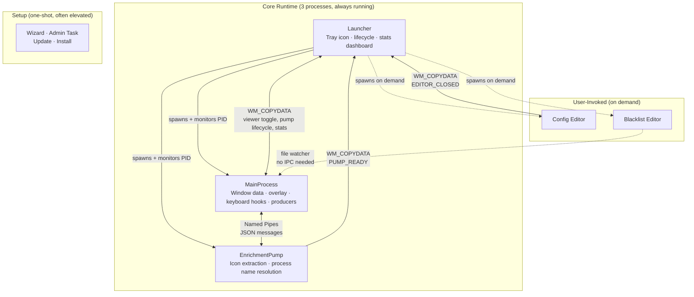

# What AutoHotkey Can Do

People dismiss AutoHotkey as a macro language — good for remapping keys and automating clicks, not for building real software. Alt-Tabby exists partly to challenge that assumption.

This page documents what we built in pure AHK v2 — no C++ shims, no native DLLs beyond what Windows ships. Just `DllCall`, `ComCall`, and a scripting language doing things it wasn't designed for: a D3D11 rendering pipeline with 183 HLSL shaders and GPU compute, a multi-process architecture with named pipe IPC, sub-5ms keyboard hooks with foreground lock bypass via undocumented COM interfaces, embedded Chromium, native dark mode through undocumented uxtheme ordinals, an 86-check static analysis pre-gate, and a build-time profiler that exports industry-standard flamecharts.

> The rendering stack grew organically through 10 distinct architecture transitions — each one was "this is probably where AHK hits its ceiling":
>
> GDI+ with `UpdateLayeredWindow` → Direct2D single-window → `ID2D1DeviceContext` via QI → DXGI SwapChain + DirectComposition → Waitable swap chain for hardware frame sync → Fixed swap chain + DComp clip (atomic resize) → D3D11 HLSL pixel shaders → Multi-texture iChannel support → Compute shaders with GPU-side particle state → DWM Compositor Clock synchronization (Win11+ undocumented API)
>
> We haven't hit the ceiling yet.

## Contents

- [A Full D3D11 Pipeline](#a-full-d3d11-pipeline) — device creation, shader compilation, bytecode caching, zero-copy DXGI sharing, fullscreen triangle VS
- [Compute Shaders and GPU-Side Particle State](#compute-shaders-and-gpu-side-particle-state) — physics simulation on the GPU
- [The Compositor Stack](#the-compositor-stack) — 8-layer compositing, 183 shaders, iChannel textures, DirectWrite text, DWM integration
- [Multi-Process Architecture](#multi-process-architecture-from-a-single-executable) — 12 runtime modes from one exe, named pipe IPC, WM_COPYDATA signals, error boundaries with crash isolation
- [The Window Store](#the-window-store) — concurrent data structure with two-phase mutation, channel queues, atomic hot-reload
- [355 Configurable Settings](#355-configurable-settings) — registry-driven config with live file monitoring, format-preserving writes
- [Embedding Chromium](#embedding-chromium-webview2) — WebView2 integration with anti-flash and callback stability
- [A Configuration Editor from Scratch](#a-configuration-editor-from-scratch) — viewport scrolling, block-based search reflow, custom-drawn sliders, ARGB color pickers — all pure Win32
- [Native Windows Theming](#native-windows-theming) — 5-layer dark mode API stack, window procedure subclassing, undocumented ordinals
- [Low-Level Keyboard Hooks](#low-level-keyboard-hooks) — sub-5ms detection, STA reentrancy, timer corruption, activation engine, cross-workspace COM uncloaking
- [Escaping the 16ms Timer](#escaping-the-16ms-timer) — QPC spin-waits, NtYieldExecution, graduated cooldowns
- [Portable Executable with Auto-Update](#portable-executable-with-auto-update) — self-replacing exe, state-preserving elevation, XML injection prevention
- [The Build Pipeline](#the-build-pipeline) — 7-stage smart-skip compilation with shader bundling
- [Test Infrastructure](#test-infrastructure) — 86-check pre-gate, worktree-isolated test suite, dual-gate parallelization
- [Build-Time Profiler](#build-time-profiler-with-flamechart-export) — zero-cost instrumentation with speedscope export
- [Performance Engineering](#performance-engineering) — event pipeline, caching, rendering, frame pacing, MCode
- [The Flight Recorder](#the-flight-recorder) — zero-cost ring buffer diagnostics, in-process debug viewer
- [Video Capture via FFmpeg](#video-capture-via-ffmpeg) — CreateProcess with stdin pipe, GDI+ screenshot export
- [Animated Splash Screen](#animated-splash-screen) — WebP streaming decode with circular ring buffer
- [Crash-Safe Statistics](#crash-safe-statistics) — atomic writes, sentinel-based recovery
- [42,000 Lines of Tooling](#42000-lines-of-tooling) — static analysis, query tools, ownership manifest, function visibility enforcement
- [By the Numbers](#by-the-numbers)

---

## A Full D3D11 Pipeline

Alt-Tabby initializes a Direct3D 11 device, creates shader resources, manages constant buffers, and dispatches GPU work — entirely through AHK's `ComCall` into COM vtable offsets. ([`d2d_shader.ahk`](../src/gui/d2d_shader.ahk))

What that means concretely:

- **Device and context creation** by querying the ID3D11Device from Direct2D's shared device
- **Shader compilation** at runtime via `DllCall("d3dcompiler_47\D3DCompile")` — HLSL source in, DXBC bytecode out
- **Constant buffer management** — a 144-byte cbuffer mapped with `WRITE_DISCARD` every frame, populated with `NumPut` for time, resolution, mouse position, selection geometry, and color data ([`alt_tabby_common.hlsl`](../src/shaders/alt_tabby_common.hlsl))
- **Render target views**, shader resource views, unordered access views — all created and bound through vtable calls
- **Draw and Dispatch calls** for pixel and compute shaders
- **Resource lifecycle** — every COM object reference-counted and released through vtable index 2

The pipeline touches **26 unique COM vtable indices** across device creation, buffer management, shader binding, and draw dispatch. All marshaled through AHK's type system with `"ptr"`, `"uint"`, and `"int"` parameter annotations. A dedicated device abstraction ([`d2d_device.ahk`](../src/gui/d2d_device.ahk)) and type marshaling layer ([`d2d_types.ahk`](../src/gui/d2d_types.ahk)) handle COM interface initialization, device loss recovery, and the raw vtable pointer arithmetic that lets AHK call into DirectX and DXGI without any helper DLLs.

### COM Refcount Management

Every COM interface query in AHK is a manual reference-counting exercise. When walking interface chains — D3D11Device → IDXGIDevice → IDXGIAdapter — each `ComObjQuery` returns a wrapped pointer that AHK will Release on scope exit. Extracting the raw pointer with `ComObjValue()` for a new wrapper requires an immediate `ObjAddRef()` to prevent use-after-free when the original wrapper goes out of scope. ([`gui_overlay.ahk`](../src/gui/gui_overlay.ahk))

This is the fundamental COM ownership pattern: `ComObjQuery → ComObjValue (extract raw ptr) → ObjAddRef (prevent premature release) → new typed wrapper`. Without the `ObjAddRef`, the original wrapper's scope-exit Release invalidates the pointer before the new wrapper can use it. C++ smart pointers handle this automatically; in AHK, every reference count is manual and every missed AddRef is a latent crash.

### ID3DBlob Lifetime Hazard

`D3DCompile` returns an `ID3DBlob` whose vtable pointers live inside `d3dcompiler_47.dll`'s memory space. If the DLL is unloaded between compilation calls — which the OS can do for delay-loaded DLLs — those vtable pointers become dangling. The fix: immediately extract bytecode via `GetBufferPointer`/`GetBufferSize` (vtable indices 3 and 4), copy to a persistent AHK `Buffer` via `RtlMoveMemory`, then Release the blob before anything else can run. The raw pointer is consumed before it can go stale. COM object lifetime across DLL boundaries — a trap that's invisible behind C++ smart pointers but fully manual in AHK, where every vtable call is a raw index into memory you don't control. ([`d2d_shader.ahk`](../src/gui/d2d_shader.ahk))

### Device Loss Recovery

When the GPU resets (driver update, monitor disconnect, TDR), every D3D11 and D2D resource is invalidated. The recovery path in `D2D_HandleDeviceLoss()` implements dependency-ordered teardown: effects (which depend on the render target) are disposed first, then D2D resources (brushes, fonts, icon cache), then the back buffer and render target, then DirectComposition visuals (child before parent), then the device itself, and finally the swap chain. Factories (`D2D1Factory`, `IDWriteFactory`) are *not* released — they're device-independent and survive the reset. After teardown, the entire pipeline is recreated in reverse order. Understanding COM object dependency graphs for safe teardown — from a scripting language. ([`gui_overlay.ahk`](../src/gui/gui_overlay.ahk))

### Bytecode Caching

In development mode, shaders compile from HLSL source at runtime. To avoid recompiling unchanged shaders, each source is MD5-hashed (via Windows CNG: `BCryptOpenAlgorithmProvider` → `BCryptCreateHash` → `BCryptHashData` → `BCryptFinishHash`) and cached as `[16-byte hash][DXBC blob]` on disk. In compiled builds, pre-compiled DXBC bytecode ships as embedded resources — zero compilation overhead at startup.

### Zero-Copy GPU Sharing

The D3D11 render target texture is created with `DXGI_FORMAT_B8G8R8A8_UNORM`. Rather than reading pixels back to the CPU, we `QueryInterface` for `IDXGISurface` and create a D2D bitmap directly from the DXGI surface via `CreateBitmapFromDxgiSurface`. D2D reads GPU memory directly — no staging buffer, no CPU readback, no copy.

### Fullscreen Triangle Vertex Shader

A single vertex shader serves all 183 pixel shaders. It generates a fullscreen triangle from `SV_VertexID` alone — 3 vertices, no vertex buffer, no input layout. UV coordinates are computed in the shader. `Draw(3, 0)` covers every pixel. One VS compiled at init, shared across the entire pipeline.

### Shader Aliasing

When multiple shader layers use the same effect (e.g., four background layers all running "raindropsGlass"), `Shader_RegisterAlias()` shares the compiled pixel shader, compute shader, compute buffer, UAV, SRV, and texture resources across all instances — but maintains independent render targets and `lastTime` animation state per alias. Four layers using the same effect share one compiled shader in GPU memory while animating independently. Adding or removing a layer doesn't recompile anything — it just creates or destroys an alias with its own render target. GPU resource sharing orchestrated from a scripting language. ([`d2d_shader.ahk`](../src/gui/d2d_shader.ahk))

### DirectComposition Two-Visual Architecture

The overlay window uses a DirectComposition visual tree with a deliberate two-level hierarchy: a parent clip visual and a child content visual. ([`gui_overlay.ahk`](../src/gui/gui_overlay.ahk))

The swap chain is created at the maximum monitor resolution via `IDXGIFactory2::CreateSwapChainForComposition` (vtable 24) and never resized. Window resize and monitor switching don't call `ResizeBuffers` (one of the most expensive DXGI operations) — instead, the parent visual's `SetClip` with a `D2D_RECT_F` dynamically masks the oversized swap chain to the current window bounds. The child visual holds the swap chain content. This means the GPU allocation is fixed at startup, and all "resizing" is just a clip rect update — a near-zero-cost operation.

Frame synchronization uses `IDXGISwapChain2::GetFrameLatencyWaitableObject` (vtable 33), which returns an auto-reset event handle that fires on VSync. `WaitForSingleObjectEx` on this handle replaces manual frame timing with hardware-synchronized rendering.

The `SetClip` call above required discovering a Windows 11 binary vtable discrepancy: the SDK header (`dcomp.h`) declares the `D2D_RECT_F` overload at vtable index 13, but the actual binary vtable on Windows 11 swaps the two `SetClip` overloads — the `D2D_RECT_F` version is at index 14. The same swap affects `SetOffsetX` overloads (cf. [win32metadata#600](https://github.com/microsoft/win32metadata/issues/600)). This kind of header-vs-binary mismatch is invisible in C++ (the compiler resolves overloads), but in AHK — where every COM call is a raw vtable index — it means calling the wrong function entirely. Diagnosed by observing `E_INVALIDARG` on the "correct" index and testing neighbors. ([`d2d_device.ahk`](../src/gui/d2d_device.ahk))

---

## Compute Shaders and GPU-Side Particle State

Thirteen mouse-reactive effects use D3D11 compute shaders for physics simulation that runs entirely on the GPU:

- **Structured buffers** with 32-byte particle stride (position, velocity, life, size, heat, flags)
- **UAV at register(u0)** written by the compute shader, **SRV at register(t4)** read by the pixel shader
- **Dispatch with 64 threads per group**, thread count computed from particle buffer size
- **Configurable grid quality** (512×256 up to 2048×1024) and particle density

The compute shader updates particle state (physics, spawning, death) while the pixel shader reads the results and renders. State persists across frames on the GPU — AHK never touches individual particles after initialization.

Buffer initialization uses an exponential doubling pattern (`RtlCopyMemory` doubling the filled region each pass) to initialize thousands of dead particles in O(log N) DllCalls instead of per-element `NumPut` loops.

Each compute shader is driven by a JSON metadata file declaring `maxParticles`, `particleStride`, and `baseParticles`. The bundler reads these to configure buffer allocation at load time — grid dimensions scale with a quality preset (512×256 to 2048×1024), and particle counts scale with a density multiplier. This means adding a new compute shader effect requires zero AHK code changes: write the HLSL, write the JSON, and the pipeline discovers and configures it automatically.

**Effects built on this pipeline:** particle systems (ember trails, campfire embers, smoke, fireflies, scatter, neon trails, long-range embers), fluid simulation (aquarium, calm fluid, emitters), and surface physics (gravity wells, water surfaces, ripples). Two additional mouse effects (caustics, spotlight) are pixel-only — no compute shader needed.

---

## The Compositor Stack

Every frame composites up to 9 layers, bottom to top: ([`gui_effects.ahk`](../src/gui/gui_effects.ahk))

1. **DWM Surface** — the desktop backdrop, untouched
2. **User Background Image** — any PNG/JPG, with fit modes (fill, contain, stretch, tile), blur, desaturation, opacity
3. **Shader Layers 1–4** — stackable D3D11 pixel shaders, each with independent opacity, darkness, desaturation, and speed controls
4. **Mouse Effect** — a compute+pixel shader pair tracking cursor position and velocity in real-time
5. **Selection/Hover Highlight** — shader-based animated highlight (aurora, glass, neon, plasma, lightning, and more) or simple D2D fill
6. **Inner Shadow** — D2D1 effect chain (Flood → Crop → GaussianBlur) for recessed-glass depth
7. **Text Rendering** — window titles, subtitles, column data, with optional soft drop shadows via separate blur effect
8. **Action Buttons** — close/kill/blacklist buttons rendered on hover

All of this runs at the monitor's native refresh rate. The shader pipeline supports time accumulation (animation state persists across overlay show/hide), per-shader time tracking (no cross-shader pollution), and entrance animations synchronized across layers. A tween engine ([`gui_animation.ahk`](../src/gui/gui_animation.ahk)) drives all motion — named tweens with configurable easing curves (`EaseOutCubic`, `EaseOutQuad`), QPC-based start times, and a global speed multiplier. Selection slides, hide fades, and entrance transitions all register as tweens and are interpolated each frame via `from + (to - from) * easing(t)`. The engine calls `winmm\timeBeginPeriod(1)` at animation start to lower the Windows timer resolution from ~16ms to ~1ms, and `timeEndPeriod(1)` on stop — another DllCall pair keeping sub-frame timing precise. An FPS debug overlay with sample-interval averaging is built in. A deferred-start guard prevents the frame loop from launching inside a paint's STA pump (which would suspend the paint quasi-thread forever — bug #175).

Behind the compositor sits a live data layer ([`gui_data.ahk`](../src/gui/gui_data.ahk)) that manages display list refresh, pre-caching during Alt key press, and safe eviction of destroyed windows during the ACTIVE state — all performance-critical paths that ensure the compositor always has fresh, consistent data to render.

The display list uses a three-array freeze design to balance structural stability with cosmetic freshness during Alt-Tab. `gGUI_LiveItems` is always fresh from the window store (canonical). When Tab is first pressed, `gGUI_ToggleBase` captures a shallow clone (frozen for workspace toggle support). `gGUI_DisplayItems` is the filtered view from ToggleBase — what actually renders. Crucially, these are *references* to live store records, not copies. Structure is frozen (no additions, no reorders), but cosmetic fields (title, icon, processName) flow through live — so if an icon resolves mid-Alt-Tab, it appears immediately without rebuilding anything. Window destroys are allowed through (they're signal, not noise), and selection tracking adjusts automatically when a destroyed window is evicted. When workspace filtering is disabled, `_GUI_FilterDisplayItems()` returns the input array unchanged — both `gGUI_ToggleBase` and `gGUI_DisplayItems` point to the *same object*. Evicting a window from one would corrupt the other. AHK has no `===` reference identity operator for objects, so `ObjPtr(gGUI_ToggleBase) != ObjPtr(gGUI_DisplayItems)` — comparing raw COM IUnknown pointers — detects aliasing before attempting removal. A language-level limitation solved with pointer introspection. ([`gui_data.ahk`](../src/gui/gui_data.ahk))

### Soft Rectangle Primitives

Inner shadows and glow effects are built from D2D1 effect chains wired entirely through `ComCall`: Flood (solid color) → Crop (rect bounds) → GaussianBlur. ([`gui_effects.ahk`](../src/gui/gui_effects.ahk))

This produces soft-edged colored rectangles without intermediate bitmaps or CPU-side image processing. Two independent chains run simultaneously for top and bottom inner shadows — avoiding reconfiguration of a single chain mid-frame. Each chain's properties (ARGB, rect, blur radius) are tracked in static locals; `SetFloat`/`SetColorF`/`SetRectF` COM calls are skipped when values haven't changed, eliminating redundant GPU state updates for config-stable effects.

On HDR displays, DWM composites in linear scRGB color space, which darkens semi-transparent GPU blurs and glows. HDR detection itself uses the Windows Display Configuration API: `GetDisplayConfigBufferSizes` → `QueryDisplayConfig` (filling `DISPLAYCONFIG_PATH_INFO` and `DISPLAYCONFIG_MODE_INFO` arrays) → `DisplayConfigGetDeviceInfo` with type `DISPLAYCONFIG_DEVICE_INFO_GET_ADVANCED_COLOR_INFO`. The code iterates all display paths, unpacking a bitfield at offset 20 for `advancedColorSupported` (bit 0) and `advancedColorEnabled` (bit 1). Three DllCalls, three struct layouts, bit-level field extraction — all to answer "is this monitor HDR?" ([`gui_overlay.ahk`](../src/gui/gui_overlay.ahk))

With HDR detected, the compositor applies a CPU-side gamma power curve to flood colors *before* they enter the blur chain — not after. Applying `GammaTransfer` after `GaussianBlur` produces bright pixel artifacts at near-transparent edges because gamma amplifies RGB above alpha in premultiplied color. Pre-chain correction on the single flood color is mathematically equivalent and artifact-free. The corrected ARGB is cached per input value and exponent, so the per-frame cost is a single Map lookup for config-stable colors. ([`gui_effects.ahk`](../src/gui/gui_effects.ahk))

### Offscreen Render-to-Texture

The background image layer (PNG/JPG with fit modes, blur, desaturation) is pre-rendered once into an offscreen D2D bitmap and cached. ([`gui_bgimage.ahk`](../src/gui/gui_bgimage.ahk))

`ID2D1DeviceContext::SetTarget` redirects D2D drawing to a target-capable bitmap (created with the `D2D1_BITMAP_OPTIONS_TARGET` flag and premultiplied alpha). The background image is composited with its effects — four fit modes (Fill, Fit, Stretch, Fixed), nine alignment points, configurable interpolation (Nearest/Linear/HighQualityCubic), and optional blur/desaturation — into this offscreen surface. The hot path draws a single `DrawBitmap` per frame. Tile mode creates a `D2D1_BITMAP_BRUSH` with WRAP extend modes, cached on config change.

### DirectWrite Text Layout

Text rendering uses DirectWrite via D2D with character-granularity ellipsis trimming (`DWRITE_TRIMMING_GRANULARITY_CHARACTER`) for clean text overflow. Text formats are cached per DPI scale, and an alignment state tracker skips redundant `SetTextAlignment` COM calls when alignment hasn't changed between consecutive draws. Subtitle strings (e.g., "Class: Chrome_WidgetWin_1") are lazily formatted once per display cycle and cached by hwnd — avoiding string concatenation on every paint frame for windows without resolved process names. ([`gui_gdip.ahk`](../src/gui/gui_gdip.ahk))

### 183 Shaders

The shader library includes 157 background shaders (raymarching, domain warping, fractals, fluid dynamics, matrix effects, aurora, and dozens more), 15 mouse-reactive shaders (particle systems, fluid simulations, physics effects), and 10 selection highlight shaders. Each shader has a JSON metadata file and an HLSL source file. A PowerShell bundling tool ([`shader_bundle.ps1`](../tools/shader_bundle.ps1)) auto-generates the AHK registration code and Ahk2Exe resource embedding directives.

### iChannel Texture System

Shaders can reference external textures (noise patterns, photos, procedural maps) via JSON metadata declaring `iChannels` with a channel index and filename. At load time: GDI+ decodes the PNG/JPG via `GdipCreateBitmapFromFile` → `GdipBitmapLockBits` extracts raw BGRA pixels → `ID3D11Device::CreateTexture2D` creates a GPU texture → `CreateShaderResourceView` makes it bindable → SRVs are bound to pixel shader sampler slots 0–N by channel index. In compiled builds, textures are embedded as resources and extracted to `%TEMP%` at startup. 26 textures across the shader library. Adding a new textured shader requires zero AHK code changes — just reference the file in the JSON metadata. ([`d2d_shader.ahk`](../src/gui/d2d_shader.ahk))

### Custom Scrollbar with Circular Wrapping

The overlay's scrollbar is entirely custom-drawn in D2D — no native Win32 scrollbar control. The thumb position is computed from `Win_Wrap0(scrollTop, count)`, a modular wrapping function that handles circular list semantics. When the list wraps (scrolling past the last window returns to the first), the thumb **splits into two D2D rounded-rect segments** — one at the bottom of the track, one wrapping to the top — each drawn only if its height is positive. The gutter and thumb brushes are cached with the D2D brush generation counter, so device loss (GPU reset, monitor disconnect) automatically invalidates them. ([`gui_paint.ahk`](../src/gui/gui_paint.ahk))

### Dual-Layer Hover Detection

Mouse tracking uses two independent mechanisms because neither is reliable alone: ([`gui_input.ahk`](../src/gui/gui_input.ahk))

- **Layer 1:** `TrackMouseEvent` with `TME_LEAVE` (0x02) requests `WM_MOUSELEAVE` notification via a manually marshaled `TRACKMOUSEEVENT` struct (16 bytes on x64: `cbSize`, `dwFlags`, `hwndTrack`, `dwHoverTime`). The struct is allocated as a `static Buffer` and reused across calls.
- **Layer 2:** A polling fallback timer (`GetCursorPos` + `GetWindowRect` every 50ms) clears hover state when the cursor leaves bounds — because `WM_MOUSELEAVE` doesn't fire reliably in all scenarios (an undocumented Windows limitation).

The hover recalculation itself short-circuits when both cursor position *and* scroll offset are unchanged — the overwhelmingly common case during Alt-Tab when the user is pressing Tab, not moving the mouse.

### DWM Composition

Alt-Tabby uses undocumented and semi-documented Windows DWM APIs for native desktop integration:

- **Acrylic blur** via `SetWindowCompositionAttribute` (undocumented user32 API) — blurred translucent backdrop with tint color
- **Mica and MicaAlt materials** via `DwmSetWindowAttribute` with `DWMWA_SYSTEMBACKDROP_TYPE` (Windows 11). DWM Mica requires `WS_CAPTION` on a non-ToolWindow — but ToolWindow is needed to suppress the taskbar entry. Solution: a hidden owner window (owned windows skip the taskbar), with `WS_SYSMENU | MINIMIZEBOX | MAXIMIZEBOX` stripped and a `WM_NCCALCSIZE` handler that zeros the non-client area to hide the title bar. The result: full Mica material with no visible chrome and no taskbar entry. `DwmExtendFrameIntoClientArea` extends the DWM frame for transparent D2D rendering on top. ([`gui_overlay.ahk`](../src/gui/gui_overlay.ahk))
- **Window cloaking** via `DWMWA_CLOAK` for zero-flash show/hide
- **Rounded corners** via `DWMWA_WINDOW_CORNER_PREFERENCE`
- **DwmFlush** for compositor synchronization after render target updates
- **Dark mode** — see [Native Windows Theming](#native-windows-theming) below
- **WS_EX_LAYERED toggle for live acrylic blur** — layered windows (`WS_EX_LAYERED`) cache the DWM acrylic blur from the last time it was composited. During fade-out, `WS_EX_LAYERED` is added (needed for alpha=0). After fade completes, `WS_EX_LAYERED` is removed — restoring live acrylic blur that updates with the desktop in real-time. Without this toggle, the overlay would show stale blur from the previous session. An undocumented behavioral insight about DWM's layered window compositing. ([`gui_animation.ahk`](../src/gui/gui_animation.ahk))

---

## Multi-Process Architecture from a Single Executable

One compiled `AltTabby.exe` serves 12 different runtime modes, selected by command-line flags. Three processes run continuously, editors launch on demand, and setup modes are one-shot tasks that often require elevation. ([`alt_tabby.ahk`](../src/alt_tabby.ahk))



The launcher is the lifecycle hub — it spawns the GUI and pump as child processes, monitors their PIDs, and handles recovery (if the pump crashes, the GUI reports via `WM_COPYDATA` and the launcher restarts it). Process termination uses a multi-phase cascade: Phase 1: `taskkill /F /IM` with PID exclusion filter (reliable for same-name processes, immune to AHK's PID ordering quirks). Phase 2: `ProcessClose` loop with configurable retry attempts for stragglers. Phase 3: if the target process survives, `advapi32\OpenProcessToken` + `advapi32\GetTokenInformation(TokenElevation=20)` inspects its security token to detect elevation — if it's running as admin, the system offers to self-elevate via `*RunAs taskkill /F /PID` for the final kill. Security token introspection from a scripting language. ([`process_utils.ahk`](../src/shared/process_utils.ahk)) A dual-mutex architecture prevents conflicts: a per-`InstallationId` mutex (`AltTabby_Launcher_<id>`) prevents renamed copies of the same installation from running simultaneously, while a system-wide `AltTabby_Active` mutex prevents different installations from colliding. `DllCall("CreateMutex")` + `GetLastError()` distinguishes "created new" from "already existed" to detect the conflict. ([`launcher_main.ahk`](../src/launcher/launcher_main.ahk)) The heavy IPC path is the named pipe between MainProcess and EnrichmentPump: UTF-8 JSON messages carrying icon and process enrichment requests. Everything else — viewer toggling, stats queries, editor lifecycle — flows through lightweight `WM_COPYDATA` signals, which piggyback on the Windows message loop AHK already runs (zero additional infrastructure). The named pipe exists because icon extraction and process name resolution block (50–100ms per call), and that latency can't live on the GUI thread. Config and blacklist changes bypass IPC entirely via file watchers in the GUI process.

The runtime mode is selected by command-line flag:

| Flag | Role |
|------|------|
| *(none)* | Launcher — tray icon, subprocess management, lifecycle |
| `--gui-only` | MainProcess — window data, producers, overlay, keyboard hooks |
| `--pump` | EnrichmentPump — blocking icon/process resolution |
| `--config` | Configuration editor (WebView2 or native AHK) |
| `--blacklist` | Blacklist editor |
| `--wizard-continue` | First-run setup (post-elevation) |
| `--enable-admin-task` | Task Scheduler task creation (post-elevation) |
| `--apply-update` | Update application (post-elevation) |
| `--update-installed` | Update installed copy (post-elevation) |
| `--repair-admin-task` | Repair stale admin task (post-elevation) |
| `--disable-admin-task` | Delete admin task (post-elevation) |
| `--install-to-pf` | Install to Program Files (post-elevation) |

The mode flag is checked before `#Include` directives execute, so each mode only initializes the code paths it needs.

### Event-Driven Producer Architecture

The MainProcess runs 8 independent data producers in `src/core/`, each responsible for a different source of window information:

| Producer | Role | Trigger |
|----------|------|---------|
| **WinEventHook** | Focus, show/hide, title changes, MRU ordering | Kernel callbacks via `SetWinEventHook` |
| **Komorebi Sub** | Workspace assignments, focused window per workspace | Named pipe subscription |
| **Komorebi State** | Full workspace state reconciliation | On-demand polling |
| **WinEnum** | Complete window discovery | Startup, snapshot requests |
| **MRU Lite** | MRU fallback if WinEventHook fails | Timer-based polling |
| **IconPump** | Icon resolution (via EnrichmentPump subprocess) | Pipe IPC responses |
| **ProcPump** | Process name resolution (via EnrichmentPump subprocess) | Pipe IPC responses |

Producers are fault-isolated at every layer. At startup, a failing producer doesn't block the others. At runtime, every producer timer callback is wrapped in a shared error boundary ([`error_boundary.ahk`](../src/shared/error_boundary.ahk)) — a crash in the icon pump doesn't take down the WinEventHook. The boundary logs the exception (message, file, line, full stack trace), increments a per-producer error counter, and triggers exponential backoff (5s → 10s → 20s → ... → 300s cap) after 3 consecutive failures. Timers keep running during backoff (early-return on tick check rather than canceling the timer), avoiding one-shot timer dispatch corruption. Recovery is automatic when the underlying issue resolves — the error counter resets on the first successful tick. Nine files use this pattern across the entire producer and pump stack. All producers write to a shared store through `WL_UpsertWindow()` and `WL_UpdateFields()`, with dirty tracking that classifies changes by impact (MRU-only, structural, cosmetic) to minimize downstream work. Because producers are eventually-consistent, the refresh path includes a foreground guard: at Alt press, `GetForegroundWindow()` is checked directly — if that hwnd isn't in the display list yet (race between `EVENT_SYSTEM_FOREGROUND` and WinEnum discovery), it's probed, upserted with current MRU data, and placed at position 1. This guarantees the currently-focused window always appears at the top.

UWP and Store apps present a platform-specific challenge: they take 2–3 seconds after window creation before their titles populate. The WinEventHook producer detects untitled new windows and schedules deferred retry timers at escalating intervals (300ms → 700ms → 1500ms) with a 10-second expiry. Each retry re-probes the title and upserts if populated — without blocking the GUI thread or wasting cycles on windows that will never have titles. ([`winevent_hook.ahk`](../src/core/winevent_hook.ahk))

Ghost windows are a separate platform challenge: apps like Outlook and Teams reuse HWNDs for temporary windows. The window "closes" but the HWND still exists — just hidden or cloaked. `IsWindow()` returns true, so standard validation doesn't remove it. `WL_ValidateExistence()` runs a multi-check pipeline: visible? DWM-cloaked? minimized? If none of these are true, it's a ghost — purged from the store. Without this, ghost windows persist in the Alt-Tab list forever. The flight recorder tracks ghost purge events for diagnostics. ([`window_list.ahk`](../src/shared/window_list.ahk))

### Named Pipe IPC

The EnrichmentPump runs in a separate process to keep blocking Win32 calls (icon extraction, process name resolution) off the GUI thread. Communication happens over named pipes, built entirely from Win32 API calls: ([`ipc_pipe.ahk`](../src/shared/ipc_pipe.ahk))

- **Server:** `CreateNamedPipeW` with `PIPE_TYPE_MESSAGE | FILE_FLAG_OVERLAPPED`, `CreateEventW` for async connect detection, `WaitForSingleObject` for connection polling
- **Client:** `CreateFileW` with `GENERIC_READ|WRITE`, `WaitNamedPipeW` for server availability with exponential backoff
- **Read/Write:** `ReadFile`, `WriteFile`, `PeekNamedPipe` for non-blocking data availability checks
- **Security:** `InitializeSecurityDescriptor` + `SetSecurityDescriptorDacl` with NULL DACL so non-elevated clients can connect to an elevated server
- **Protocol:** UTF-8 JSON lines over message-mode pipes

The pipe wakeup pattern uses `PostMessageW` after writes to signal the receiver immediately instead of waiting for its next timer tick. Combined with graduated timer cooldown (8ms active → 20ms → 50ms → 100ms idle), the system is responsive under load and silent when idle.

The GUI side supervises the pump with hang detection: request and response tick timestamps are tracked, and if the pump stops responding within a configurable timeout, the system automatically falls back to local icon/process resolution. A heartbeat mode (2-second slow poll) checks whether the pump process window still exists via `IsWindow()` — detecting pump death even during idle periods with no active requests. Recovery is automatic when the pump is restarted. ([`gui_pump.ahk`](../src/gui/gui_pump.ahk))

### Async I/O via Thread Pool Completion

The komorebi subscription engine eliminates timer-based polling entirely using Windows I/O completion ports. `BindIoCompletionCallback` binds the named pipe handle to the OS thread pool; when data arrives, a 52-byte x86-64 MCode trampoline ([`OVERLAPPED.ahk`](../src/lib/OVERLAPPED.ahk)) marshals the completion back into AHK's GUI thread via `SendMessageW`. The result: zero CPU when idle, instant wake on data — no 8ms timer tick to wait for. If async binding fails on a given handle, the system falls back gracefully to legacy timer-based polling, and a 2-second maintenance timer can promote back to async mode at runtime.

### Cross-Process Icon Handle Sharing

Icon resolution is expensive (50–100ms per window, blocking). The EnrichmentPump resolves icons in its own process, but rather than serializing pixel data over IPC, it sends the raw `HICON` handle as a JSON integer. This works because `HICON` handles are kernel-wide USER objects in `win32k.sys` shared memory — a handle resolved in one process is valid in any other process in the same session. The GUI process receives the numeric handle and uses it immediately for D2D rendering. Per-EXE master icon caching deduplicates across windows from the same application, and per-window no-change detection (comparing raw handle values) skips redundant updates. The pump also tracks icon source metadata (method, raw handle, exe path) per hwnd — when MainProcess signals `needsIcon` for a window, stale cached sources are invalidated, catching HWND reuse where apps destroy and recreate windows with the same handle. On the GUI side, pre-cached D2D1Bitmaps survive window destruction — if a window disappears during Alt-Tab, its icon continues rendering from cache indefinitely rather than showing a blank frame. ([`enrichment_pump.ahk`](../src/pump/enrichment_pump.ahk))

### UWP/MSIX Package Icon Resolution

Windows Store and MSIX-packaged apps don't have traditional `.exe` icons — their logos live inside the package installation directory, declared in an XML manifest. Resolving them requires a 3-step chain through Windows package management APIs: `OpenProcess` → `kernel32\GetPackageFullName` (detects MSIX packaging and retrieves the full package name) → `kernel32\GetPackagePathByFullName` (maps the package name to its installation directory) → AppxManifest.xml parsing for the `Square44x44Logo` asset path. The logo path includes scale-factor wildcards — the resolver probes `Scale-200`, `Scale-100`, and other variants to find the best available asset. Results are cached per package path (bounded to 50 entries with FIFO eviction) so multiple windows from the same Store app resolve with a single manifest parse. ([`icon_pump.ahk`](../src/core/icon_pump.ahk))

---

## The Window Store

The window store ([`window_list.ahk`](../src/shared/window_list.ahk)) is the shared mutable data structure at the center of everything — 8 producers write to it, the compositor reads from it, and the keyboard hook thread can't afford to wait. It's a concurrent data structure built from AHK Maps and Critical sections.

### Two-Phase Store Mutation

Store operations that touch external state (like `WinGetTitle`, which sends `WM_GETTEXT` and can block 10–50ms on hung apps) use a two-phase pattern: Phase 1 classifies changes *outside* a Critical section — calling DllCalls, probing windows, building local change lists. Phase 2 applies all mutations inside a single Critical block. A `WS_SnapshotMapKeys()` helper takes a frozen key snapshot before iteration, preventing the "modification during iteration" crash that AHK Maps are vulnerable to. Used by `WL_EndScan`, `WL_ValidateExistence`, and `WL_PurgeBlacklisted`.

### Channel-Based Work Queues with Dedup

Enrichment work is split into separate queues — `gWS_IconQueue`, `gWS_PidQueue`, `gWS_ZQueue` — each with a parallel dedup Map. The icon pump can drain its queue independently while the PID pump waits on blocking WMI/registry calls. Dedup maps prevent the same hwnd from being enqueued twice during rapid event bursts. Selective pump draining with O(1) dedup — a concurrent work queue architecture in a scripting language.

### Atomic Blacklist Hot-Reload

When `blacklist.txt` changes on disk, the reload path ([`blacklist.ahk`](../src/shared/blacklist.ahk)) builds new pre-compiled regex arrays entirely in local variables, then atomically swaps the globals under a single Critical block. Producers calling `Blacklist_IsMatch()` mid-reload see either the complete old rule set or the complete new one — never an empty or half-populated array. Callers snapshot the global refs to locals before iterating, so even if another reload lands mid-loop, the local snapshot remains valid. Classic concurrent hot-reload, in a scripting language.

---

## 355 Configurable Settings

The entire application is driven by a centralized config registry (`config_registry.ahk`) with 355 settings across 15 sections. Each entry declares its type, default, min/max bounds, and description. Validation, documentation generation, and editor UI are all registry-driven — adding a setting to one file propagates everywhere automatically.

Both `config.ini` and `blacklist.txt` are live-monitored via `ReadDirectoryChangesW` with 300ms debounce. Edit either file in Notepad, save, and the app picks up the change — config changes trigger a full restart through the launcher, blacklist changes hot-reload the eligibility rules in-process. This also means `git checkout` of a different config branch just works.

A startup writability pre-check probes the config file before any real writes happen: the launcher writes a test key (`_WriteTest`) to `config.ini` and immediately deletes it. If either operation fails, the user gets a one-time warning per session. This catches OneDrive sync locks, Dropbox file conflicts, antivirus interference, and read-only media *before* the user changes a setting and discovers it won't persist. ([`launcher_main.ahk`](../src/launcher/launcher_main.ahk))

Config writes use a format-preserving INI writer ([`config_loader.ahk`](../src/shared/config_loader.ahk)) that scans the existing file, matches keys in-place (even commented-out ones like `; KeyName=value`), uncomments and updates while preserving surrounding comments, and only appends truly new keys at the end. Users can comment out settings in their INI and have them resurrect with formatting intact when re-enabled through the editor.

Version upgrades transparently migrate renamed or combined config keys. For example, the v0.9.0 migration merges `AcrylicAlpha` + `AcrylicBaseRgb` into a single `AcrylicColor` ARGB value — including a byte swap to correct a historical quirk where the old value was stored in BGR order (passed directly to DWM without RGB conversion). The migrator reads the old keys, swaps R↔B bytes, packs alpha into the high byte, and writes the corrected ARGB — only if the user hasn't already customized the new key. Orphaned keys from obsolete versions are automatically cleaned up, with pending comment buffering to avoid deleting description comments that belong to valid keys.

---

## Embedding Chromium (WebView2)

The configuration editor embeds a full Chromium instance via Microsoft's WebView2 control, using [thqby's WebView2.ahk](https://github.com/thqby/ahk2_lib) wrapper for the COM interop. The wrapper handles the WebView2 lifecycle — but integrating it into a production application required solving several AHK-specific problems: ([`config_editor_webview.ahk`](../src/editors/config_editor_webview.ahk))

```
AHK GUI Window
  └─ WebView2 Control (Chromium renderer)
       └─ HTML/CSS/JS configuration UI
            ↕ postMessage / WebMessageReceived
       AHK event handlers
```

- **Anti-flash:** WebView2 crashes if the hosting window is DWM-cloaked during initialization (it needs compositor access). Solution: a three-phase dance — start off-screen at alpha 0, uncloak for WebView2 init, re-cloak after navigation completes, center the window while invisible, set alpha to 255, then uncloak for the reveal. Zero white flash. ([`gui_antiflash.ahk`](../src/shared/gui_antiflash.ahk))
- **Callback stability:** The `WebMessageReceived` handler must be stored in a global variable. If referenced only locally, AHK's garbage collector destroys it while the event subscription is active. Messages silently stop arriving.
- **Callback reentrancy:** Calling `ExecuteScript()` or `GUI.Show()` from inside a `WebMessageReceived` callback permanently corrupts the handler. All heavy work is deferred to a fresh timer thread via `SetTimer(func, -1)`.
- **Resource embedding:** Ahk2Exe's RT_HTML resource type breaks on CSS `%` values (it tries to dereference them). HTML resources use `.txt` extension instead.

The fallback is a [pure AHK native editor](#a-configuration-editor-from-scratch) — and it's not a fallback in capability, just in technology choice.

---

## A Configuration Editor from Scratch

The WebView2 editor explores one path — embedded Chromium with AHK glue. The native editor is the reaction: we can do almost as well with pure Win32. No browser engine, no HTML, no JavaScript. Just AHK v2 creating windows, subclassing controls, and marshaling structs. ([`config_editor_native.ahk`](../src/editors/config_editor_native.ahk))

### Viewport Scrolling

The editor implements a scrolling viewport using the same technique game engines use for sidescrollers: a clipping parent with a repositioned child. The viewport GUI is created with `WS_CLIPCHILDREN` (0x02000000) and `WS_VSCROLL` (0x00200000). Each configuration section is a separate child GUI sized to its full content height. Scrolling moves the entire page via a single `pageGui.Move(0, -scrollPos)` call — controls never reposition relative to their parent, eliminating the jittery redraw that comes from repositioning individual controls. Per-page scroll positions are tracked independently, and mouse wheel deltas accumulate via a drain timer (`SetTimer(_CEN_DrainScroll, -10)`) to prevent lost scroll messages during rapid scrolling. A `SCROLLINFO` struct (28 bytes, `SIF_ALL = 0x17`) keeps the native scrollbar thumb synchronized.

### Block-Based Search with Layout Reflow

Search transforms the editor between two structural layouts in real-time:

**Normal mode:** The sidebar shows sections, clicking a section shows its page in the viewport.

**Flat mode (during search):** All pages containing matches are stacked vertically into a single scrollable surface. Each page tracks its content as *blocks* — data structures holding `{kind, startY, endY, ctrls}` where `kind` is `"header"`, `"subsection"`, `"setting"`, or `"addlayer"`, and `ctrls` is an array of `{ctrl, origX, origY}` references to the actual GUI controls. During search reflow, non-matching blocks are hidden and an offset accumulator shifts all subsequent blocks upward: `ctrl.Move(origX, origY - offset)`. The page's `contentH` is recalculated as `origContentH - totalOffset`. When search clears, every control snaps back to its original Y position — no destroy/recreate cycle, no layout drift.

The search input itself debounces at 200ms to prevent reflow spam during rapid typing.

### Custom-Drawn Sliders via NM_CUSTOMDRAW

Windows' built-in slider (trackbar) control ignores dark mode entirely — the `DarkMode_Explorer` theme produces a barely-visible thumb with no hover feedback. The editor subclasses sliders via `WM_NOTIFY` with `NM_CUSTOMDRAW` (code -12), intercepting the draw at two stages:

**Channel fill (TBCD_CHANNEL = 3):** The handler queries the thumb center via `TBM_GETTHUMBRECT` (0x0419), then fills the channel in two colors — accent color left of the thumb (the "filled" portion), gutter gray to the right. The split point is clamped to channel bounds to prevent overdraw.

**Thumb draw (TBCD_THUMB = 2):** A custom ellipse replaces the default thumb via `DllCall("Ellipse")` with accent color on normal/hover and a darkened variant on press. Item state flags (`CDIS_HOT = 0x40`, `CDIS_SELECTED = 0x01`) drive the color selection. The NMCUSTOMDRAW struct offsets on x64 — `HDC` at offset 32, `Left/Top/Right/Bottom` at 40–52, `dwItemSpec` at 56, `uItemState` at 64 — are the kind of platform-specific detail that makes NM_CUSTOMDRAW from a scripting language genuinely unusual.

### Bidirectional Float-Slider Synchronization

Numeric settings with min/max bounds get a slider + edit box pair with bidirectional sync. For float settings (e.g., 0.5–2.0), the integer slider range is computed dynamically: `sliderMax = Round(floatRange * 10)` for ranges > 1.0, or 100 for ranges ≤ 1.0. Conversion runs both directions — slider-to-edit (`fMin + (sliderVal / sMax) * (fMax - fMin)`, formatted to 2 decimal places) and edit-to-slider (the reverse with clamping). A re-entrancy guard object (`floatSyncGuard := {v: false}`) prevents infinite update loops between the two controls. After each slider update, `InvalidateRect` forces a full repaint to show the custom two-tone channel fill at the new position.

### Dynamic Array Sections

Repeatable config sections (e.g., 4 stackable shader layers) use a template expansion system. Registry entries with `{N}` placeholders in their group names (e.g., `Shader{N}_ShaderName`) are stored as templates. `_CEN_DetectLayerCount()` probes the INI file for `[Shader.1]`, `[Shader.2]`, etc. to determine how many layers exist. Templates are cloned per active layer with `StrReplace(tmpl.g, "{N}", n)`.

Adding a layer increments the count and calls `_CEN_RebuildArrayPage()` — which destroys the old page GUI entirely, re-expands templates with the new count, and rebuilds from scratch. Removing a layer shifts all config values down (layer 3 becomes layer 2, layer 4 becomes layer 3), tracks the vacated last section in `gCEN["RemovedSections"]` for INI cleanup on save, and rebuilds. Scroll position is preserved across rebuilds (clamped to the new maximum).

### ARGB Color Pickers

Hex color fields get a live-preview swatch, a native Windows color picker dialog, and (for ARGB values where max > `0xFFFFFF`) a separate alpha slider.

The swatch is rendered via window subclassing (`SetWindowSubclass`) with a custom `WM_PAINT` callback. It draws a checkerboard background (alternating 5×5px tiles of `0xC0C0C0` and `0x808080` — the universal transparency indicator), then composites the user's color on top using `AlphaBlend` with a premultiplied-alpha DIB section. The `BLENDFUNCTION` struct packs `AC_SRC_OVER` + `AC_SRC_ALPHA` into a single DWORD. A 1px border frames the result.

The color picker uses the native `ChooseColorW` dialog via a manually marshaled `CHOOSECOLOR` struct (72 bytes on x64). `rgbResult` is stored in BGR `COLORREF` format (converted via `Theme_RgbToColorRef`), and a persistent 64-byte custom colors buffer (16 `COLORREF` slots) survives across picker invocations. After the picker closes, RGB is recombined with the preserved alpha channel: `(alpha << 24) | newRGB`.

### Seven Control Types

The editor handles 5 base types — `bool` (checkbox), `enum` (dropdown), `int` (slider + edit + up/down), `float` (slider + edit with decimal formatting), `file` (read-only edit + browse/clear buttons) — plus two variants: dynamic enum (shader selection with live-discovered options) and hex color (swatch + picker + optional alpha slider). All rendered, themed, and synchronized in pure AHK.

---

## Native Windows Theming

Alt-Tabby implements the full Windows dark mode API stack — including undocumented APIs that Microsoft ships but doesn't publicly document — from pure AHK v2. ([`theme.ahk`](../src/shared/theme.ahk))

### The Dark Mode API Layers

Windows dark mode isn't a single API call. It's five layers, each targeting a different part of the UI:

1. **`SetPreferredAppMode`** (uxtheme ordinal #135) — tells Windows this process wants dark mode. Must be called before any GUI is created or context menus render light regardless.
2. **`AllowDarkModeForWindow`** (uxtheme ordinal #133) — enables dark mode per-window. Applied to each GUI after construction.
3. **`FlushMenuThemes`** (uxtheme ordinal #136) — forces context menus to repaint after a mode change. Without it, menus render in the old theme until the process exits. Three undocumented uxtheme ordinals total.
4. **`DwmSetWindowAttribute`** with `DWMWA_USE_IMMERSIVE_DARK_MODE` (attribute 20) — darkens the title bar and window frame.
5. **`SetWindowTheme`** with `"DarkMode_Explorer"` — re-themes individual controls (edit boxes, dropdowns, tree views) to use the dark variant of their visual style.
6. **`WM_CTLCOLOR*` message handlers** — for controls where `SetWindowTheme` isn't enough, custom color handlers return cached GDI brushes for background and text colors.

All six layers are called through `DllCall` — ordinal imports for the undocumented uxtheme functions, standard calls for DWM and user32.

### Beyond Dark Mode

The theming goes deeper than light vs. dark:

- **System theme following** — a `WM_SETTINGCHANGE` listener detects when the user toggles dark/light in Windows Settings and re-themes all windows and controls automatically
- **Force override** — users can force dark or light regardless of system setting
- **User-customizable palettes** — 15+ color slots for each mode (background, text, accent, border, control backgrounds, etc.) all configurable via `config.ini`
- **Win11 title bar customization** — `DwmSetWindowAttribute` with attributes 34 (caption color), 35 (text color), and 36 (border color) for custom-colored title bars, not just dark/light
- **Window materials** — `DWMWA_SYSTEMBACKDROP_TYPE` (attribute 38) for Mica, MicaAlt, and Acrylic backdrop effects on supported Windows 11 builds
- **Rounded corners** — `DWMWA_WINDOW_CORNER_PREFERENCE` (attribute 33) for controlling corner radius on Win11
- **Drop-in dark MsgBox** — `ThemeMsgBox()` replaces the standard `MsgBox` with a fully themed version, used throughout the application for consistent dark mode dialogs
- **Per-monitor DPI awareness** — a three-level progressive fallback initializes DPI support across OS versions: `SetProcessDpiAwarenessContext` (Windows 10 1703+) → `SetProcessDpiAwareness` (Windows 8.1+) → `SetProcessDPIAware` (Vista+). Each call is wrapped in a `try` — the first one that succeeds wins. Combined with raw Win32 positioning via `GetMonitorInfoW` + `SetWindowPos` (AHK's `Gui.Move` has DPI scaling bugs), this ensures pixel-perfect window placement on multi-monitor setups with mixed DPI scaling. ([`gui_win.ahk`](../src/gui/gui_win.ahk))
- **Native tooltip controls** — the dashboard creates Win32 tooltip controls from scratch via `CreateWindowEx("tooltips_class32")` + `TTM_ADDTOOLW`, with manual `TOOLINFOW` struct marshaling that handles platform-dependent pointer offsets (32-bit vs 64-bit struct layouts). Per-control tooltips are updated dynamically as subprocess status changes. ([`launcher_about.ahk`](../src/launcher/launcher_about.ahk))
- **Semantic control marking** — `Theme_MarkPanel()`, `Theme_MarkMuted()`, `Theme_MarkAccent()`, and `Theme_MarkSidebar()` tag controls with semantic purpose rather than explicit colors. `WM_CTLCOLOR*` handlers apply the correct palette based on marking — controls declare *what they are*, the theme system decides *how they look*. This decouples layout from appearance: switching between dark and light mode doesn't require touching any control creation code. An inheritance-like design pattern in a language with no control classes.

The theme system is shared across all native AHK GUIs (config editor, blacklist editor, wizard, debug viewer). The main overlay is excluded — it has its own ARGB compositor — but every dialog and editor window gets automatic dark mode without per-window effort.

### Window Procedure Subclassing

For controls where `SetWindowTheme("DarkMode_Explorer")` isn't enough, the theme system subclasses window procedures directly from AHK. `GetWindowLongPtrW(..., -4)` retrieves the current window procedure, `SetWindowLongPtrW(..., -4, callback)` installs an AHK callback as the replacement, and `CallWindowProcW()` chains to the original for unhandled messages. This lets AHK intercept `WM_PAINT` and `WM_CTLCOLOR*` at the native level — redirecting paint to apply dark mode text colors and returning cached GDI brushes for control backgrounds. Window procedure subclassing from a scripting language. ([`theme.ahk`](../src/shared/theme.ahk))

### Tab Control Dark Mode via Double-Layer Paint

Windows Tab3 controls completely ignore `SetWindowTheme("DarkMode_Explorer")` — the text stays black on dark backgrounds regardless. The fix uses a double-layer paint technique: subclass the Tab3 control via `SetWindowLongPtrW`, intercept `WM_PAINT`, and call the *original* WndProc first — it paints the visual theme chrome (backgrounds, borders, tab shapes). Then paint custom text *on top* via GDI: `GetDC`, `SetBkMode(TRANSPARENT)`, `SetTextColor(palette.text)`, and `DrawTextW` per tab with `DT_CENTER | DT_VCENTER | DT_SINGLELINE`. The loop queries each tab's rectangle via `TCM_GETITEMRECT` and text via `TCM_GETITEM` with a manually marshaled `TCITEMW` struct (40 bytes on x64, 28 on x86 — platform-dependent offsets for `pszText` and `cchTextMax`). Static buffers for `RECT`, `TCITEMW`, and text avoid per-paint allocation. The original WndProc handles the heavy structural rendering; the custom layer surgically fixes the text color — a precise override rather than a full owner-draw reimplementation. On GUI destruction, `SetWindowLongPtrW` restores the original WndProc and `CallbackFree` releases the callback. ([`theme.ahk`](../src/shared/theme.ahk))

### GDI Alpha Compositing for Color Swatches

The native configuration editor includes ARGB color pickers with live alpha-channel preview — rendered through custom GDI compositing in AHK. ([`config_editor_native.ahk`](../src/editors/config_editor_native.ahk))

Each color swatch control is subclassed via `SetWindowSubclass()` with a custom `WM_PAINT` callback. The callback draws a checkerboard background pattern (the universal transparency indicator), then overlays the user's selected color using `AlphaBlend()` with premultiplied ARGB pixel handling. When the config value's max exceeds `0xFFFFFF`, the editor automatically separates the alpha channel into a dedicated percentage slider with a live-updating text label. Hex input, swatch preview, and alpha slider are synchronized through a re-entrancy guard (`hexSyncGuard`) that prevents infinite update loops.

### Owner-Draw Buttons with Hover Animation

Standard Windows buttons ignore dark mode theming entirely. The theme system converts buttons to `BS_OWNERDRAW` style and handles `WM_DRAWITEM` with custom GDI painting — rounded corners, theme-aware colors, and smooth state transitions. A 30ms hover-tracking timer polls cursor position to detect mouse enter/leave (AHK has no native hover events for buttons). Button state tracks hover, pressed, and default; the pressed color is derived from the hover color via a 20% darkening curve. Custom button rendering with state animation, from a scripting language. ([`theme.ahk`](../src/shared/theme.ahk))

---

## Low-Level Keyboard Hooks

Alt-Tabby intercepts Alt+Tab before Windows processes it. The keyboard hook, window data, and overlay all run in the same process — no IPC on the critical path. ([`gui_interceptor.ahk`](../src/gui/gui_interceptor.ahk))

### Sub-5ms Detection

When Alt is pressed, the hook fires immediately (AHK low-level keyboard hook via `$*` prefix). Only the *first* Tab gets a deferred decision window (configurable, default 24ms) to disambiguate Alt+Tab from standalone Tab input. Once `gINT_SessionActive := true`, **all subsequent Tabs bypass the decision logic entirely** — matching native Windows Alt+Tab behavior where rapid Tab cycling works without per-press delays.

The decision itself uses a two-timer pattern to resolve a race condition between Alt release and Tab decision: the configured decision window fires first, then defers the *actual* decision by 5ms via a second one-shot timer (`INT_TAB_DECIDE_SETTLE_MS := 5`). This settle delay guarantees the Alt_Up handler has time to set `gINT_AltUpDuringPending := true` before the final decision runs — making the race between hook callbacks deterministic. Total detection latency from first keypress to state machine transition: under 5ms. ([`gui_interceptor.ahk`](../src/gui/gui_interceptor.ahk))

### SetWinEventHook from AHK

Real-time window events (create, destroy, focus, minimize, show, hide, name change) come through `SetWinEventHook` called directly via `DllCall` with a 7-parameter callback created by `CallbackCreate`. Three narrow hook ranges (instead of one wide range) let the Windows kernel skip filtering — only relevant events reach the callback. ([`winevent_hook.ahk`](../src/core/winevent_hook.ahk))

The callback is inline-optimized: event constants are hardcoded as literals instead of global variable lookups, eliminating 10 name resolutions per invocation on a path that fires hundreds of times per second.

### Transparent Alt Observation via vkE8 Masking

Alt is hooked as `~*Alt` (pass-through) to observe state without consuming the keypress. But Windows interprets a lone Alt release as "activate the menu bar." Fix: `Send("{Blind}{vkE8}")` emits virtual key code `0xE8` — an undefined/unassigned VK code that Windows silently ignores. This masks the Alt release from triggering menu activation while preserving the original keypress for other applications. An AHK-specific trick exploiting an undocumented gap in the virtual key table. ([`gui_interceptor.ahk`](../src/gui/gui_interceptor.ahk))

### Defense in Depth

Windows silently removes low-level keyboard hooks if a callback takes longer than `LowLevelHooksTimeout` (~300ms). A D2D paint during a Critical section can exceed this. The defense stack:

1. **`SendMode("Event")`** — AHK's default `SendInput` temporarily uninstalls all keyboard hooks. `SendMode("Event")` keeps them active.
2. **`Critical "On"`** in all hotkey callbacks — prevents one callback from interrupting another mid-execution
3. **Physical Alt polling** via `GetAsyncKeyState` — detects lost hooks independent of AHK's hook state
4. **Active-state watchdog** — 500ms safety net catches any stuck ACTIVE state
5. **Event buffering** — keyboard events queue during async operations (workspace switches) instead of being dropped

### STA Message Pump Reentrancy

D2D/DXGI/DWM COM calls pump the STA message loop, dispatching timer callbacks and keyboard hooks *mid-operation*. `BeginDraw`, `EndDraw`, `DrawBitmap`, `SetWindowPos`, `ShowWindow`, `DwmFlush` — any of these can trigger an Alt+Up callback that resets state while the compositor is still drawing. This is AHK's hidden concurrency trap: `Critical "On"` doesn't block COM's internal message pump.

The solution is context-dependent Critical section management. In the hotkey handler (`GUI_OnInterceptorEvent`), Critical stays held for the entire handler — the code has no internal abort points, so interruption corrupts state. In the deferred grace timer (`_GUI_GraceTimerFired`), Critical is released *before* heavy D2D work — safe because the show path has 3 abort points that detect `gGUI_State != "ACTIVE"` and bail. Holding Critical through the 1–2 second first paint would exceed Windows' `LowLevelHooksTimeout` (~300ms), causing silent hook removal. The paint path itself uses a reentrancy guard with `try/finally` to prevent nested paints from STA pump dispatch — without the `finally`, any exception would permanently block all future rendering. The same reentrancy trap affects mouse input: initiating window activation from inside a `WM_LBUTTONDOWN` handler fails because the frame loop's `Present` call pumps the STA queue in a different state than a timer thread. The fix defers activation out of the mouse handler via `SetTimer(fn, -1)` — the one-shot timer fires in a normal timer context where the frame loop can render correctly. ([`gui_input.ahk`](../src/gui/gui_input.ahk))

### One-Shot Timer Callback Corruption

Running complex nested call chains (state machine transitions, window activation) inside a one-shot `SetTimer(func, -period)` callback permanently corrupts AHK v2's internal timer dispatch for that function. Future `SetTimer(func, -period)` calls silently fail — forever. Discovered in bug #303.

The fix: defer heavy work to a fresh timer thread via `SetTimer(DoWork.Bind(args), -1)` instead of running inline. The callback returns cleanly, and the deferred work runs in an isolated timer context that can't corrupt the original. This pattern appears throughout the state machine — grace timer recovery, lost-Alt detection, and async activation all use deferred `.Bind()` to avoid the corruption path. Producer error recovery uses the same principle: exponential backoff keeps timers alive (5s → 10s → ... → 300s cap) rather than canceling and recreating them, avoiding the dispatch corruption entirely.

### Window Activation Engine

`SetForegroundWindow` is restricted by Windows security policy — you can't steal focus from another application unless the calling process meets specific criteria. The activation engine ([`gui_activation.ahk`](../src/gui/gui_activation.ahk)) bypasses this with a multi-technique approach borrowed from komorebi's `windows_api.rs`:

1. **Dummy `SendInput` trick** — sends an empty `INPUT_MOUSE` structure (40 bytes of zeros) via `SendInput`. This satisfies Windows' requirement that the calling process has received "recent input" before `SetForegroundWindow` is permitted. No actual mouse movement occurs — it's a zero-op that tricks the foreground lock policy.
2. **TOPMOST/NOTOPMOST Z-order dance** — `SetWindowPos` briefly sets the target window as `HWND_TOPMOST`, then immediately clears it to `HWND_NOTOPMOST`. This forces the window to the top of the Z-order without permanently making it topmost. During overlay fade-out, a simpler `HWND_TOP` is used instead to avoid Z-order flicker.
3. **Dead window retry** — if the selected window disappears between Tab and Alt-Up (`IsWindow()` returns false), the engine tries the next eligible window in the display list rather than failing silently. The flight recorder tracks the retry with original hwnd, retry hwnd, and success flag.
4. **`SetForegroundWindow` with verification** — the actual focus call, followed by `GetForegroundWindow` to verify it worked (the return value alone isn't reliable).

### Cross-Workspace Activation

Activating a window on a different komorebi workspace adds several layers of complexity:

**Direct komorebi pipe communication** — instead of spawning `komorebic.exe` (50–100ms process creation overhead per call), the engine can send JSON commands directly to komorebi's named pipe at `\\.\pipe\komorebi` via `CreateFileW` + `WriteFile`. Sub-millisecond workspace switches. Controlled by config with transparent CLI fallback.

**Three-strategy workspace confirmation** — after requesting a workspace switch, the engine needs to know when it's complete. Three polling strategies, selectable via config:
- **PollCloak** — queries `DwmGetWindowAttribute(DWMWA_CLOAKED)` on the target window. Sub-microsecond DllCall, lowest latency.
- **AwaitDelta** — reads the current workspace name from the komorebi producer (updated via heartbeat). Zero process spawns.
- **PollKomorebic** — spawns `komorebic query focused-workspace-name` each tick. Most reliable across multi-monitor setups.

**COM-based window uncloaking** — for windows on the current workspace that are DWM-cloaked, the engine walks undocumented Windows shell COM interfaces to uncloak them directly:

1. Create `ImmersiveShell` via undocumented CLSID `{C2F03A33-...}`
2. `QueryInterface` for `IServiceProvider` — raw vtable pointer arithmetic (`NumGet(vtable, 0, "UPtr")`)
3. `QueryService` (vtable index 3) for `IApplicationViewCollection` — tries multiple GUIDs across Windows versions
4. `GetViewForHwnd` to get the `IApplicationView` for the target window
5. `SetCloak(1, 0)` + `SwitchTo()` for uncloak and activation

This is the same COM path that Windows' own Alt+Tab uses internally, accessed entirely through AHK's `DllCall` and manual vtable navigation.

**Per-workspace focus caching** — komorebi workspace switch events are state-inconsistent (the snapshot is taken mid-operation). Rather than trusting the event's `ring.focused` field, the engine maintains a per-workspace cache of the last reliably focused hwnd, populated only from trustworthy events (`FocusChange`, `Show`). During rapid workspace switching, stale `EVENT_SYSTEM_FOREGROUND` events from Windows are suppressed with a 2-second cooldown that auto-expires — never cleared early, because premature clearing during rapid switches caused MRU flip-flop and visible selection jiggle.

**Event buffering with lost-Tab synthesis** — during a workspace switch, `komorebic`'s internal `SendInput` temporarily uninstalls all keyboard hooks (a Windows limitation). If the user presses Tab during this window, the keystroke is lost. The engine detects this pattern — `ALT_DOWN` + `ALT_UP` buffered without any `TAB_STEP` in between — and synthesizes the missing Tab event at the correct position before replaying the buffer. The buffer state machine uses four phases — `polling`, `waiting`, `flushing`, `""` (idle) — where the `flushing` phase prevents events that arrive after activation completes but before buffer replay from bypassing the queue. Escape is the exception: it immediately cancels a pending activation without buffering, giving responsive tactile feedback even during 500–1000ms workspace transitions.

**Workspace mismatch auto-correction** — during focus processing, the system detects if a focused window's workspace assignment differs from the current workspace in metadata. This means a komorebi event was missed (pipe overflow, reconnection, etc.). Rather than showing stale data until the next full state poll, the system silently corrects the current workspace — implicit self-healing via consistency checking, without user intervention. ([`winevent_hook.ahk`](../src/core/winevent_hook.ahk))

### Game Mode Bypass with Multi-Monitor Fullscreen Detection

When a fullscreen game or blacklisted process is focused, the Tab hotkey is disabled entirely — Alt-Tabby stays out of the way. The bypass check runs two tests: first, process name lookup against a pre-computed `static` Map (built once on first call via AHK's static initializer semantics — `static bypassList := _INT_BuildBypassList()`), then fullscreen geometry detection via `_INT_IsFullscreenHwnd()`. ([`gui_interceptor.ahk`](../src/gui/gui_interceptor.ahk))

The fullscreen check is multi-monitor aware: `Win_GetMonitorBoundsFromHwnd()` retrieves the full bounds of *the window's monitor* (not the primary monitor), then compares window dimensions against that monitor's resolution with a configurable threshold (default 95%). An origin-relative tolerance check (`Abs(x - monitorLeft) <= tolerancePx`) handles borderless windowed games that are a few pixels off-origin — common in multi-monitor setups. WinEventHook sets bypass mode on focus; when focus leaves, Tab hotkeys re-enable immediately.

---

## Escaping the 16ms Timer

AHK's `Sleep` and `SetTimer` have ~16ms resolution (the Windows timer tick). For latency-critical paths, Alt-Tabby uses: ([`timing.ahk`](../src/shared/timing.ahk))

- **QueryPerformanceCounter** via `DllCall` for sub-microsecond timestamps (the `QPC()` function used throughout)
- **Hybrid high-precision sleep** — for durations over 20ms, native `Sleep(ms - 20)` handles the bulk, then a QPC spin-loop with `NtYieldExecution` (to yield CPU timeslices) handles the precise tail
- **Graduated timer cooldown** — IPC pipe timers step through 8ms → 20ms → 50ms → 100ms based on idle streak counters, reactive to activity bursts
- **PostMessage wake** — after pipe writes, `PostMessageW` signals the receiver immediately instead of waiting for the next timer tick
- **Runtime API discovery via GetProcAddress** — undocumented Win11+ functions like `DCompositionWaitForCompositorClock` and `DCompositionBoostCompositorClock` can't be hard-linked — calling them on Win10 crashes at load time (missing entry point). Instead, `DllCall("GetProcAddress", "ptr", hDComp, "astr", "DCompositionWaitForCompositorClock")` resolves the function pointer at runtime. If the pointer is null, the feature is unavailable and the system falls through to the next tier. This pattern enables graceful OS-version detection without `#If` guards or version number parsing — the API's presence *is* the feature check. ([`gui_animation.ahk`](../src/gui/gui_animation.ahk))
- **Three-tier frame pacing** — the animation system selects from three synchronization strategies based on OS and hardware capabilities. **Tier 1 (Win11+):** `DCompositionWaitForCompositorClock` — the undocumented API resolved above — synchronizes directly with the DWM composition clock, not just VSync but the actual frame boundary the compositor uses for visual updates. **Tier 2:** The waitable swap chain object from `IDXGISwapChain2::GetFrameLatencyWaitableObject` (VSync-paced). **Tier 3:** Pure QPC spin-wait with `NtYieldExecution` yielding (~0.5ms per yield) as a software fallback. The system probes Tier 1 first and falls through automatically. Monitor refresh rate is auto-detected via `EnumDisplaySettingsW` with `DEVMODEW` struct unpacking (offset 184 for `dmDisplayFrequency` — the correct DEVMODEW offset, not the DEVMODEA offset 120 that many examples get wrong).
- **Kernel event objects for frame loop shutdown** — the compositor clock wait (`WaitForSingleObjectEx`) blocks until the next frame boundary — but when Alt is released and the overlay needs to stop, the frame loop must exit *immediately*, not wait for the next VSync. A manual-reset event created via `DllCall("CreateEvent", "ptr", 0, "int", 1, "int", 0, "ptr", 0)` solves this: the frame loop waits on *both* the compositor clock handle *and* the quit event. When the hotkey handler calls `SetEvent(gAnim_QuitEvent)`, the wait unblocks instantly. `ResetEvent` resets it for the next Alt-Tab session. Windows kernel synchronization primitives — `CreateEvent`, `SetEvent`, `ResetEvent`, `WaitForSingleObjectEx` — orchestrating clean shutdown between AHK execution contexts. ([`gui_animation.ahk`](../src/gui/gui_animation.ahk))

---

## Portable Executable with Auto-Update

A single compiled `.exe` with no installer, no registry entries, no external dependencies:

- **Self-replacing update:** The running exe renames itself to `.old` (Windows allows renaming a running executable), copies the new version to the original path, relaunches, and cleans up `.old` on next startup. Updates are checked via `WinHttp.WinHttpRequest.5.1` COM object against the GitHub releases API — JSON response parsed for version tag and download URLs, semantic version comparison determines if an update is available, and downloaded executables are validated by checking PE headers (MZ magic bytes and size bounds) before the swap is attempted. ([`setup_utils.ahk`](../src/shared/setup_utils.ahk))
- **State-preserving elevation:** When UAC elevation is needed, the current state is serialized to a temp file, the exe relaunches via `*RunAs` with a flag like `--apply-update`, and the elevated instance reads the state file to continue. The reverse direction is also handled: launching a *non-elevated* process from an elevated context uses `ComObject("Shell.Application").ShellExecute()` — the same de-elevation technique used by Sysinternals tools, since Windows provides no straightforward API for dropping elevation.
- **Task Scheduler integration:** Optional admin mode creates a scheduled task (`schtasks`) with `HighestAvailable` run level for UAC-free operation. InstallationId tracking prevents cross-directory task hijacking. The task creation path generates XML for `schtasks /Create` — user-controllable data (exe path, installation ID, description) is sanitized through `_XmlEscape()` before embedding, preventing XML injection that could modify task properties or create additional scheduled tasks. ([`setup_utils.ahk`](../src/shared/setup_utils.ahk))
- **Version mismatch detection:** When launched from a different directory than an existing installation, the launcher compares semantic versions and handles three scenarios: current is *newer* → offer to update the installed copy; current is the *same version* → clearer "duplicate location" messaging; current is *older* → offer to launch the installed version instead. A `g_MismatchDialogShown` flag prevents the auto-update check from racing with the mismatch dialog. ([`launcher_install.ahk`](../src/launcher/launcher_install.ahk))
- **Smart compilation:** The build script compares source file timestamps against the compiled exe and skips Ahk2Exe when nothing changed. Resource embedding handles icons, splash images, DXBC shader bytecode, HTML assets, and DLLs.
- **File-based cross-elevation IPC:** When UAC elevation is needed for admin toggle, the launcher can't use named pipes or WM_COPYDATA (different privilege levels, no shared window). Instead: parent writes a tick-stamped lock file → launches elevated process → elevated instance overwrites the file with a result string (`"ok"`, `"cancelled"`, `"failed"`) → parent polls at 500ms intervals with 30-second timeout. The filesystem as a message channel — the only IPC mechanism that reliably crosses elevation boundaries without infrastructure. ([`launcher_tray.ahk`](../src/launcher/launcher_tray.ahk))

---

## The Build Pipeline

The compile script ([`compile.ps1`](../tools/compile.ps1)) isn't a thin wrapper around Ahk2Exe. It's a multi-stage build pipeline with smart-skip at every step:

1. **Config documentation generation** — an AHK script reads the config registry and generates `docs/options.md` with all settings, defaults, ranges, and descriptions. Skipped if the output is newer than the registry source.
2. **AGENTS.MD generation** — consolidates `CLAUDE.md` and `.claude/rules/` into a single file for non-Claude AI agents. Smart-skip via timestamp.
3. **Version stamping** — reads the `VERSION` file and generates Ahk2Exe directives for `ProductVersion` and `FileVersion`.
4. **Shader bundling** — discovers all HLSL+JSON pairs in `src/shaders/`, generates `shader_bundle.ahk` (metadata, registration functions, category arrays) and `shader_resources.ahk` (`@Ahk2Exe-AddResource` directives for 183 shaders + 26 textures). Skipped if outputs are newer than all inputs.
5. **Shader compilation** — compiles HLSL sources to DXBC bytecode via `D3DCompile`. Each shader skipped individually if its `.bin` is newer than its `.hlsl` + common header. Stale shaders are partitioned into N chunks (1–8 workers based on CPU count), each worker receiving a manifest file listing its assigned `hlslPath|binPath|entryPoint|target` tuples. N AHK worker processes compile in parallel, with the common header (`alt_tabby_common.hlsl`) auto-injected before each shader source and `#line` directives preserving accurate error line numbers. The aggregator validates DXBC magic bytes (`0x44584243`) on every output `.bin`. A subtle .NET interop fix captures `$proc.Handle` immediately after `Start-Process` — without this, fast-exiting worker processes release their native handle before the exit code can be read, causing silent compilation failures.
6. **Profiler stripping** — copies `src/` to a temp directory and strips every line tagged `;@profile`. The `--profile` flag skips this step for instrumented debug builds. Uses a junction for `resources/` to avoid copying assets.
7. **Ahk2Exe compilation** — compiles the (possibly stripped) source with embedded icon, resources, and version info. Smart-skip if the exe is newer than all source files, resources, and VERSION.

Each step has independent staleness detection. A typical no-change rebuild completes in under a second. The `--force` flag overrides all skips. The `--timing` flag emits machine-readable `TIMING:step:ms` output for CI integration.

The pipeline also handles junction/symlink resolution for process management (finding and killing only *this directory's* AltTabby instances, not the user's personal install or other worktree test processes), and provides detailed error recovery when the exe is locked by a running process.

---

## Test Infrastructure

AHK v2 has no built-in test runner, no assertion library, and no parallel execution. The language's compiler silently accepts code that will fail at runtime — missing `global` declarations create local variables instead, wrong parameter counts go unnoticed, and `Critical "On"` without matching `"Off"` leaks silently. These don't crash; they generate dialog popups that block automated testing or cause silent misbehavior. We built the testing infrastructure from scratch. ([`tests/`](../tests/))

### Static Analysis Pre-Gate

Every test run begins with 86 static analysis checks — PowerShell scripts that scan AHK source for patterns the compiler misses. Bundled into 12 parallel bundles, the pre-gate runs in ~8 seconds and blocks all tests (unit, GUI, and live) if any check fails. New checks are auto-discovered: drop a `check_*.ps1` in the test directory and it's enforced on the next run. The bundling isn't arbitrary — sub-checks within a bundle share pre-computed file caches, function boundary maps, and JIT-compiled regex patterns (`[regex]::new(..., 'Compiled')` for .NET JIT compilation). For example, `rpCleanedCache` (cleaned lines + brace depths) is computed once and reused by both the `return_paths` and `unreachable_code` checks. A shared query helper library ([`_query_helpers.ps1`](../tools/_query_helpers.ps1)) provides `HashSet<string>` for O(1) keyword lookups and `Bulk-CleanLines` that eliminates per-line function call overhead (~30k calls → 1 call) across all 17 query tools and the static analysis checks.

What they catch:

| Category | Checks | Examples |
|----------|--------|----------|
| **Scoping** | `check_globals`, `switch_global` | Missing `global` declarations — AHK silently creates a local instead of accessing the file-scope variable |
| **Concurrency** | `critical_leaks`, `critical_sections`, `critical_heavy_calls`, `callback_critical` | Unmatched `Critical "On"`/`"Off"`, COM calls inside Critical (blocks the STA pump), missing Critical in hotkey callbacks |
| **Functions** | `check_arity`, `check_dead_functions`, `check_undefined_calls`, `duplicate_functions` | Wrong parameter counts, calls to functions that don't exist, dead code |
| **Lifecycle** | `timer_lifecycle`, `destroy_untrack`, `scan_pairing` | Unmatched SetTimer/kill, missing cleanup on window destroy, unbalanced BeginScan/EndScan |
| **Correctness** | `return_paths`, `unreachable_code`, `bare_try`, `numeric_string_comparison` | Functions that fall through without returning, dead code after return, swallowed errors, string-vs-number comparison bugs |
| **Patterns** | `v1_patterns`, `send_patterns`, `map_dot_access`, `dllcall_types` | AHK v1 syntax in a v2 codebase, `SendInput` (uninstalls hooks), dot access on Map objects, wrong DllCall type annotations |
| **Ownership** | `global_ownership`, `function_visibility` | Cross-file mutation of globals not listed in the ownership manifest, calls to `_Private()` functions from other files |
| **Resources** | `dead_globals`, `dead_locals`, `dead_params`, `dead_config`, `lint_ignore_orphans` | Unused variables, config keys defined but never read, stale lint-ignore annotations |
| **Integrity** | `registry_key_uniqueness`, `registry_completeness`, `config_registry_integrity`, `fr_event_coverage` | Duplicate config keys, missing registry fields, flight recorder events defined but never emitted |
| **Load-time** | `check_warn` | VarUnset warnings that would produce blocking dialog popups at runtime |

One check deserves special mention: `check_warn` ([`check_warn.ps1`](../tests/check_warn.ps1)) detects variables that AHK's `#Warn VarUnset` would flag at load time — but which are normally suppressed by a safety-net `#Warn VarUnset, Off` directive in production. The check copies all `src/*.ahk` to a temp directory, regex-strips the suppression directives from non-lib files, auto-generates an `#Include` chain by parsing the production entry point (so the wrapper can never drift from the real include order), runs with `//ErrorStdOut` to capture load-time warnings as parseable text instead of blocking dialog popups, then maps temp paths back to real source paths for readable output. A compile-time analysis that requires runtime loading — solved by creating a disposable mirror of the entire source tree.

### Test Suite

The test harness runs three types of tests in parallel where possible:

- **Unit tests** — production source files are `#Include`'d directly, with mocks for visual/external layers (COM, DllCall, GUI objects). Tests call real production functions, not copies. 25 test files covering store operations, state machine transitions, IPC protocol, blacklist logic, and more.
- **GUI state machine tests** — exercise the full IDLE → ALT_PENDING → ACTIVE state machine with mock rendering, verifying freeze behavior, workspace toggle, escape handling, and config combinations.
- **Live integration tests** — launch the compiled `AltTabby.exe` as a real process, interact via named pipes and WM_COPYDATA, and verify end-to-end behavior including komorebi integration and heartbeat monitoring.

The harness uses poll-based waiting (`WaitForFlag`) instead of fixed sleeps, so tests complete as fast as the system allows. Process launching uses cursor suppression and cleanup utilities. The pre-gate gates *all* test types — static analysis catches AHK coding errors that pass compilation but generate runtime dialog popups, which would break the automated flow for any test running AHK code.

The entire suite is worktree-isolated — multiple agents or users can run tests simultaneously on the same host without interference. Named pipes, mutexes, log files, and process kills are all scoped to the worktree path, so a test run in one git worktree won't collide with another running in the main checkout or a different branch.

Timing instrumentation reports per-check and per-suite durations with bottleneck detection. A dedicated benchmark script measures AHK startup overhead to evaluate parallelization split strategies — because at 12,700 lines of test code, the bottleneck is often process launch time, not test execution.

The `--timing` flag produces a hierarchical timing report showing the two-gate parallelization strategy: Pre-Gate and Compilation run simultaneously, and whichever finishes first unlocks its dependent tests immediately (arrows show which gate released which wave). Truncated example:

```
=== TIMING REPORT ===
                                                    Offset   Duration
----------------------------------------------------------------------
        Phase 1: Pre-Gate + Compilation              +0.2s      10.8s
     ┌─   Compilation                                           10.6s ◄── slowest
     │      Ahk2Exe                                              7.1s ◄── slowest
     │      Profile Strip                                        2.2s
     │      ⋮ (5 more steps)
     │ ┌─  Pre-Gate                                              8.8s
     │ │     check_batch_functions.ps1                            8.5s ◄── slowest
     │ │       check_globals                                     2.3s ◄── slowest
     │ │       check_arity                                       1.2s
     │ │       ⋮ (3 more sub-checks)
     │ │     check_batch_patterns.ps1                             6.4s
     │ │       ⋮ (16 sub-checks)
     │ │     ⋮ (8 more bundles)
     │ │   Phase 2: Tests                            +9.0s      23.5s ◄══ bottleneck
     │ └▸       GUI Tests                            +9.0s       8.0s
     │          Unit/Core/Store                                   7.7s
     │          ⋮ (9 more unit suites)
     └───▸      Live/Watcher                        +10.8s      21.7s ◄── slowest
                Live/Pump                                        19.7s
                ⋮ (4 more live suites)
----------------------------------------------------------------------
Total wall-clock                                                32.5s
```

---

## Build-Time Profiler with Flamechart Export

Alt-Tabby includes a compile-time instrumentation profiler that generates industry-standard flamecharts — with zero cost in production builds. ([`profiler.ahk`](../src/shared/profiler.ahk))

### How It Works

Functions are instrumented with matched `Profiler.Enter()` / `Profiler.Leave()` calls, tagged with a `;@profile` comment:

```ahk
Profiler.Enter("_GUI_PaintOverlay")  ; @profile
; ... rendering work ...
Profiler.Leave()  ; @profile
```

The `compile.ps1` build script strips every line containing `;@profile` from production builds. The profiler code is physically removed from the compiled executable — not disabled, not behind a flag, *gone*. Zero runtime cost, zero binary size cost.

### Recording

In debug builds, the profiler writes QPC timestamps (~100ns precision) into a pre-allocated ring buffer holding the most recent 50,000 events — several minutes of recording at typical call rates. A configurable hotkey toggles recording on/off. No file I/O during recording, no allocations, no measurable impact on the code being profiled.

### Flamechart Visualization

On stop, the profiler exports to [speedscope](https://www.speedscope.app/) JSON format — the same format used by Chrome DevTools, Firefox Profiler, and other industry tools. Open the JSON in speedscope.app (runs entirely in-browser, no upload) and get:

- **Flamecharts** — call stacks over time, showing exactly what ran when and for how long
- **Left-heavy aggregation** — merged call trees showing where cumulative time is spent
- **Sandwich view** — callers and callees of any function

This means you can profile an AHK v2 application with the same tooling used for C++ and JavaScript performance work. The profiler infrastructure (ring buffer, QPC timestamps, speedscope export) is itself written in AHK.

---

## Performance Engineering

Beyond the architecture, specific patterns push AHK's performance across every layer of the stack.

### Event Pipeline

- **Kernel-side event filtering** — three narrow `SetWinEventHook` ranges instead of one wide range (0x0003–0x800C). The Windows kernel skips events that don't match any range entirely — they never reach the AHK callback. On systems with active menus, drag-drop, or selection events, this eliminates thousands of irrelevant dispatches per second.
- **Inlined constants in hot callbacks** — the WinEventHook callback fires hundreds of times per second. Every `global` declaration in AHK costs a name lookup on each invocation. Event codes are hardcoded as integer literals (`0x0003` instead of `EVENT_SYSTEM_FOREGROUND`), eliminating ~10 global name resolutions per callback.
- **Static initializer for one-time computation** — the game mode bypass list uses `static bypassList := _INT_BuildBypassList()`, where AHK evaluates the initializer exactly once on first call. All subsequent bypass checks are O(1) Map lookups against this pre-computed set. The pattern — compute once at first use, serve forever — appears throughout the codebase for data that's expensive to build but immutable after startup. ([`gui_interceptor.ahk`](../src/gui/gui_interceptor.ahk))
- **Config property caching for hot paths** — `gCached_UseAltTabEligibility` and `gCached_UseBlacklist` cache two config booleans checked ~30+ times per Alt-Tab (once per window in the eligibility filter). Avoids `cfg.HasOwnProp()` property table scan on every call. Config changes trigger a full process restart, making invalidation automatic — a zero-cost cache with guaranteed freshness. ([`config_loader.ahk`](../src/shared/config_loader.ahk))
- **Short-circuit no-change updates** — when a focus event fires for the already-focused window, the entire store mutation path is skipped before entering a Critical section. Keyboard-heavy users with focus ping-ponging don't cause useless store operations.
- **Three-layer JSON parsing** for komorebi events — string search for event type → quick extract for specific fields → full JSON parse only when structurally necessary. Avoids parsing 200KB state blobs for the ~80% of events that don't need it.
- **Static array recycling** — hot-path arrays in the WinEventHook batch processor reset with `.Length := 0` (clears data without deallocating backing capacity), then `Push` reuses existing storage. Zero-allocation pattern in a callback firing 100+ times/second.
- **Batch store mutations** — multiple window updates during workspace transitions (cloak/uncloak of 10+ windows) are batched into a single `WL_BatchUpdateFields` call. One store revision bump instead of N, one display list rebuild instead of N.
- **Offset-based line parsing** — IPC message extraction from the pipe buffer tracks a numeric offset instead of slicing the string per-message. `InStr(buf, "\n", , offset)` finds the next delimiter, `SubStr` extracts just that line, and the offset advances. A single `SubStr` at the end removes consumed data. This turns O(N²) per-burst string slicing (where each `SubStr` copies the remaining buffer) into O(N) with one final copy — critical during icon resolution bursts (10+ messages/second).
- **Arithmetic buffer length tracking** — the komorebi subscription engine maintains buffer length as an arithmetic counter (incremented on append, decremented on extraction) instead of calling O(n) `StrLen()` after every read. A safety clamp resyncs via `StrLen` only when the buffer is fully consumed or an error is detected — an edge-case guard, not normal-path overhead.
- **Cloak event batching** — during komorebi workspace switches, 10+ cloak/uncloak events fire in rapid succession. Instead of N individual store mutations, events are buffered into a Map (`hwnd → isCloaked`) and flushed as a single batch update — one revision bump, one display list rebuild instead of N.
- **Exponential backoff with live timers** — when a producer timer hits repeated errors, backoff escalates from 5s → 10s → 20s → ... → 300s cap. Timers are *not* canceled — they continue firing but early-return during cooldown. This avoids one-shot timer dispatch corruption and means recovery is automatic when the underlying issue resolves.
- **Hung window guard** — `WinGetTitle` sends `WM_GETTEXT`, which blocks 5–10 seconds on frozen applications. Every window probe calls `IsHungAppWindow` first — a fast kernel check that doesn't send messages. Hung windows are skipped or deferred to a retry pass. Without this, a single frozen Electron app blocks the entire event pipeline. ([`winevent_hook.ahk`](../src/core/winevent_hook.ahk), [`win_utils.ahk`](../src/shared/win_utils.ahk))
- **Lazy Z-order vs. cosmetic classification** — `NAMECHANGE` and `LOCATIONCHANGE` events fire thousands of times per second but don't affect Z-order. Separate Maps (`_WEH_PendingZNeeded`, `_WEH_PendingLocChange`) flag which windows actually need structural enrichment. Monitor label probes run only on `LOCATIONCHANGE` (cross-monitor moves); Z-order updates only on visibility/focus changes. Microsecond-level event classification in the hot path.
- **Fast-path one-shot timer wrapper** — AHK quirk: `SetTimer(fn, -1)` (one-shot) replaces any existing periodic timer for the same function reference. To fire an immediate batch without killing the 100ms periodic heartbeat, a separate `_WEH_FastPathBatch` wrapper function isolates the one-shot from the periodic timer. High-priority events (focus, show) get instant processing without disrupting the background heartbeat.
- **IPC batch deduplication** — the GUI pump drains multiple enrichment queues (icon + PID) per tick, deduplicates via a static Map, and sends a single consolidated IPC message instead of separate requests. Reduces pipe round-trips during enrichment bursts when many windows appear simultaneously. ([`gui_pump.ahk`](../src/gui/gui_pump.ahk))
- **Async komorebi state query** — `komorebic state` (50–100ms process creation overhead) runs as a background process writing to a temp file. The GUI polls for completion without blocking and returns the cached result immediately. A 500ms TTL prevents thrashing while ensuring fresh data. Timeout kills stale processes and temp files are cleaned up. ([`komorebi_lite.ahk`](../src/core/komorebi_lite.ahk))
- **Negative PID cache with restart guard** — process name resolution via `QueryFullProcessImageNameW` fails for system processes (PID 0, PID 4, protected services). Both the GUI-side proc pump and the EnrichmentPump maintain a negative cache: failed PIDs are recorded with `A_TickCount` and skipped for a configurable TTL (default 60s). The TTL expiry check includes `!ProcessExist(pid)` — a PID is only retried if the TTL has expired AND the process is confirmed dead. This prevents the cache from permanently skipping a process that was restarted with the same PID within the TTL window (common for system services). Housekeeping prunes expired entries and dead PIDs on heartbeat. ([`proc_pump.ahk`](../src/core/proc_pump.ahk), [`enrichment_pump.ahk`](../src/pump/enrichment_pump.ahk))
- **Pump idle/wake framework** — icon, process, and WinEvent batch pumps share a reusable lifecycle pattern: `Pump_HandleIdle()` counts consecutive empty ticks and pauses the timer (`SetTimer(fn, 0)`) after N idle cycles. `Pump_EnsureRunning()` restarts on demand when new work arrives. Both check-then-act paths are wrapped in Critical sections to prevent a race between the pause decision and an incoming wake signal. Zero CPU when idle, instant wake on demand. ([`pump_utils.ahk`](../src/shared/pump_utils.ahk))
- **Cursor feedback suppression** — test process launches use `CreateProcessW` with `STARTF_FORCEOFFFEEDBACK` (0x80) in the `STARTUPINFO` struct, suppressing Windows' "app starting" busy cursor animation. A small Win32 detail that eliminates visual noise during automated test runs. ([`process_utils.ahk`](../src/shared/process_utils.ahk))
- **Monotonic MRU protection** — store mutations reject stale `lastActivatedTick` writes that are older than the current record value. Prevents concurrent producers (WinEventHook + Komorebi, running from different event sources at different latencies) from corrupting MRU ordering with out-of-order timestamps. ([`window_list.ahk`](../src/shared/window_list.ahk))
- **Superseded focus check** — after a slow window probe (~10–50ms for `WinGetTitle` on hung apps), the WinEventHook re-checks whether a newer focus event arrived during the probe. If superseded, the stale upsert is skipped entirely — preventing slow probes from overwriting a more recent focus change with stale data. ([`winevent_hook.ahk`](../src/core/winevent_hook.ahk))
- **TTL-based window removal** — windows that disappear from WinEnum but still pass `IsWindow()` are tracked with `missingSinceTick`. They're only removed after a 1200ms TTL, preventing false positives from transient visibility changes (e.g., a window briefly hidden during a workspace transition animation). Immediate removal caused flickering in the display list during workspace switches. ([`window_list.ahk`](../src/shared/window_list.ahk))
- **Staggered timer startup** — Z-pump, validation, and housekeeping timers start with `-17ms`, `-37ms`, `-53ms` initial delays — prime numbers chosen to prevent timer thundering herd. Timers that would otherwise all fire on the first tick are spread across different initial phases, avoiding a startup CPU spike when 5+ timer callbacks coincide. ([`gui_main.ahk`](../src/gui/gui_main.ahk))
- **Lightweight vs. full probe paths** — in-store windows skip immutable fields (class, PID) during WinEventHook updates, fetching only mutable title + visibility/cloaked/minimize state. New windows get the full probe with all fields. Avoids redundant cross-process `WinGetClass`/`WinGetPID` DllCalls on every batch — fields that can't change without window destruction. ([`winevent_hook.ahk`](../src/core/winevent_hook.ahk))
- **Idle timer auto-pause with demand-wake** — the WinEventHook batch timer enters idle after 10 consecutive empty ticks (`SetTimer(fn, 0)`), consuming zero CPU when the system is quiet. When the WinEvent callback queues new events, it calls `Pump_EnsureRunning()` to restart the timer immediately. Sub-5ms wake from zero-cost idle. The same pattern is used by all 5 producer pumps via the shared `pump_utils.ahk` framework. ([`pump_utils.ahk`](../src/shared/pump_utils.ahk))

### Display List & Caching

- **Three-path display list cache** — Path 1: cache hit, return cached record references under Critical (~1μs). Path 1.5: only MRU fields changed, move-to-front reorder of the cached array (O(N), ~100μs for 100 windows) instead of full quicksort. Path 3: full filter + sort, only on structural changes. Most frames during Alt-Tab hit Path 1 or 1.5.
- **Cache hit race fix** — Path 1 wraps the entire validation-and-return in a Critical section. Without it, a producer could bump `gWS_Rev` and set dirty flags *between* the cache check and the return — the caller would receive stale rows tagged with a new revision number. A semantic consistency bug where the rev says "fresh" but the data says "stale." ([`window_list.ahk`](../src/shared/window_list.ahk))
- **Dirty tracking with field classification** — global revision counter with fields classified as internal/mruSort/sort/content. Internal changes (icon cooldown, cache metadata) don't bump the revision. MRU-only changes take the fast path. Only structural changes trigger full reprocessing.
- **Incremental MRU sort** — when only one window's MRU timestamp changed, a move-to-front O(N) operation replaces a full quicksort. The quicksort itself uses Bentley-McIlroy 3-way partitioning with median-of-3 pivot selection and insertion sort cutoff at partition size 20. The 3-way partition is critical: many background windows share `lastActivatedTick = 0`, and standard 2-way partitioning degrades to O(n²) on duplicate-heavy inputs. ([`sort_utils.ahk`](../src/shared/sort_utils.ahk))
- **MRU batch leader tracking** — `WL_BatchUpdateFields()` tracks which hwnd in a batch had the highest `lastActivatedTick` bump via a `batchBumpedTick` accumulator. This single hwnd becomes `gWS_MRUBumpedHwnd` — the target for Path 1.5's O(N) move-to-front. Without leader tracking, the batch would need a full sort even when only one window's MRU position actually changed. ([`window_list.ahk`](../src/shared/window_list.ahk))
- **Sort invariant validation** — after the incremental move-to-front, the code validates that the first 3 consecutive pairs maintain descending `lastActivatedTick` order. If any pair violates the invariant (multi-item MRU batches can leave remaining items out-of-order), it falls through to Path 3 for a full rebuild. The fast path is always verified, never trusted blindly. ([`window_list.ahk`](../src/shared/window_list.ahk))
- **Pre-sized array capacity** — before Loop+Push sequences, `arr.Capacity := targetCount` pre-allocates backing storage. AHK arrays double-and-copy on overflow, triggering GC pressure. Pre-sizing eliminates all intermediate allocations. Applied systematically across 8 sites in the store: cache hit paths, MRU reorder, full rebuild, batch operations, and snapshot creation. ([`window_list.ahk`](../src/shared/window_list.ahk))
- **Pre-compiled regex** — blacklist wildcard patterns compiled to regex at load time, not per-match
- **UWP logo path cache** — resolved UWP app logo file paths cached by package path, bounded to 50 entries with FIFO eviction. Multiple windows from the same UWP app reuse a single resolved path instead of re-parsing the package manifest each time. ([`icon_pump.ahk`](../src/core/icon_pump.ahk))
- **Monitor handle-to-label lazy cache** — monitor handles mapped to labels ("Mon 1", "Mon 2") with lazy fill: the first request enumerates all monitors once, subsequent requests are O(1) Map lookups. `WM_DISPLAYCHANGE` invalidates the cache when monitors are connected or disconnected. Uses a `static Buffer` for the RECT structure in `MonitorFromRect` to avoid per-call allocation. ([`win_utils.ahk`](../src/shared/win_utils.ahk))
- **Background icon pre-cache batching** — HICON → GDI+ bitmap conversion (expensive: GDI interop + premultiply) runs in batches of 4 icons per 50ms timer tick during non-ACTIVE state. The timer self-arms if the batch cap is hit and stops when the cache is complete. This prevents icon conversion from competing with the paint path during Alt-Tab, while ensuring icons are ready before the user presses Tab. ([`gui_data.ahk`](../src/gui/gui_data.ahk))
- **Display list hwnd→record Map** — a parallel `gWS_DLCache_ItemsMap` maintains O(1) hwnd-keyed lookup alongside the ordered display list array. Operations like close/kill button clicks and workspace filtering use the Map instead of O(N) linear scans. ([`window_list.ahk`](../src/shared/window_list.ahk))
- **Pre-computed hwndHex** — `Format("0x{:X}", hwnd)` is computed once at store record creation and stored as `hwndHex`. Every logging path, flight recorder dump, and diagnostic display reuses this pre-formatted string instead of calling `Format()` per reference.
- **Object identity for MRU move-to-front** — the MRU update uses `==` (AHK object identity) instead of hwnd comparison when scanning the live items array. Object identity is atomic — no field access overhead — and safe against HWND aliasing if Windows recycles a handle across window lifetimes. ([`gui_activation.ahk`](../src/gui/gui_activation.ahk))
- **Static return object reuse** — `_WS_ApplyPatch()` uses a `static` return object mutated in-place rather than creating a new object per call. The same 4-field result struct (`changed`, `sortDirty`, `contentDirty`, `mruOnly`) is reused across thousands of patch operations — amortizing AHK object construction cost to zero in the hottest store path. AHK objects are surprisingly expensive to construct; this pattern avoids it entirely. ([`window_list.ahk`](../src/shared/window_list.ahk))
- **Field classification Map** — a single pre-computed `gWS_FieldClass` Map replaces three separate `Map.Has()` calls per field per patch. Each field is classified once at init (`"internal"`, `"sort"`, `"mruSort"`, `"content"`); the patch loop does one `Map.Get()` instead of three `Map.Has()` lookups — half the hash operations in the per-field-per-window-per-update hot path. ([`window_list.ahk`](../src/shared/window_list.ahk))
- **Single-lookup Map.Get() pattern** — systematic use of `gWS_Store.Get(hwnd, 0)` with fallback default instead of `Has(hwnd)` followed by `[hwnd]`. Each `Has()` + `[]` pair computes the hash twice; `.Get(key, default)` does it once. Applied at 11+ call sites across the store with explicit `; PERF: single lookup` comments — half the hash operations in every store access path. ([`window_list.ahk`](../src/shared/window_list.ahk))
- **Hwnd normalization** — all hwnd values are coerced to numeric via `hwnd := hwnd + 0` on ingestion. AHK's polymorphic types mean `"0x12345678"` (string) and `0x12345678` (number) are *different* Map keys. Without normalization, the same window can exist twice in the store under two different key types — a silent correctness bug invisible in strongly-typed languages but critical in AHK. ([`window_list.ahk`](../src/shared/window_list.ahk))

### Rendering Pipeline

- **D2D effect object caching** — COM `GetOutput()` results and D2D1 effect references cached at initialization, eliminating per-frame ComCall overhead. Without caching: ~480 string-keyed Map lookups and ~20 COM method calls per second. With caching: direct pointer access, zero Map lookups in the paint path.
- **D2D solid color brush FIFO cache** — ARGB color values cached to `ID2D1SolidColorBrush` COM objects, bounded to 100 entries with FIFO eviction. Working set is ~5–10 UI colors. COM wrappers auto-release via `__Delete` when evicted. Hot-path code reuses brushes for common colors instead of create+destroy per frame. ([`gui_gdip.ahk`](../src/gui/gui_gdip.ahk))
- **Batch cbuffer writes** — D3D11 constant buffer updates consolidated from 35 individual NumPut+ComCall sequences to 3 per shader layer per frame (Map → batch NumPut → Unmap).
- **D3D11 state dirty flag** — shader pipeline tracks whether constant buffer and sampler bindings need re-issuing after D2D's `BeginDraw` (which shares the device context and invalidates D3D11 state). Batch mode defers render target and SRV unbinding between sequential shader passes.
- **Viewport-based repaint skipping** — cosmetic changes to off-screen items (title updates, icon resolution) don't trigger a paint cycle
- **Frame-loop-aware repaint skip** — during rapid mouse wheel scroll (especially Logitech infinite scroll wheels), calling `GUI_Repaint()` synchronously on every `WM_MOUSEWHEEL` floods the message queue. When the animation frame loop is active, the synchronous repaint is skipped entirely — the next frame will pick up the scroll change. This prevents message queue saturation without losing visual responsiveness. ([`gui_input.ahk`](../src/gui/gui_input.ahk))
- **Layout metric caching** — 25+ pre-computed pixel metrics cached per DPI scale, rebuilt only when scale changes (monitor switch, DPI setting change)
- **Static buffer reuse** — `DllCall` marshal buffers declared as `static` in hot-path functions, repopulated via `NumPut` before each call. Zero allocation pressure on GC.
- **D2D geometry caching** — rounded rectangle geometries tracked by 5 static parameters (x, y, w, h, radius). Only recreated on cache miss. Selection rect moves every frame during Alt-Tab but geometry dimensions stay stable across hundreds of frames — skips `CreateRoundedRectangleGeometry` COM call + Release per paint.
- **Exponential doubling for GPU buffer init** — compute shader particle buffers (thousands of elements) initialized via `RtlCopyMemory` doubling: write one template element, then copy 1→2→4→8→... Reduces O(N) individual `NumPut` calls to O(log N) memory copies. Initializing 8192 particles takes ~13 copies instead of 8192 writes.
- **Mouse velocity tracking with exponential smoothing** — frame-to-frame cursor delta is converted to pixels/second, then fed through an exponential smoothing filter for a stable velocity estimate. This smoothed velocity is packed into the shader cbuffer for mouse-reactive effects (particle reactivity, fluid disturbance intensity). The filter prevents abrupt jumps from high-DPI mouse movement or frame timing jitter from propagating as visual noise.
- **DWM geometry nudge** — after a komorebi workspace switch, the DWM backdrop can show stale content from the previous workspace. A ±1px `SetWindowPos` nudge forces DWM to re-sample the desktop composition. The DirectComposition clip rect masks the transient pixel movement — invisible to the user, but enough to trigger a backdrop refresh.
- **DPI-aware resource invalidation** — a `WM_DPICHANGED` (0x02E0) message handler detects monitor DPI changes (moving the window between monitors, or the user changing display scaling). It zeroes `gD2D_ResScale` and `gGdip_ResScale`, forcing D2D text formats, brushes, and layout metrics to recreate on the next paint at the correct scale. Monitor refresh rate is detected via `EnumDisplaySettingsW` with `ENUM_CURRENT_SETTINGS` for frame pacing calibration.
- **Adaptive mouse shader frame skipping** — when a mouse effect exceeds its frame budget, the compositor skips rendering it on the next frame, reusing the cached texture. The rest of the overlay continues at full FPS. This decouples expensive particle/fluid effects from the UI framerate without visible stutter.
- **D2D brush generation counter** — every static brush cache tracks a generation counter. When the D3D11 device is lost (GPU reset, driver update, monitor disconnect), `gD2D_BrushGeneration` increments. On the next paint, stale caches detect the mismatch and recreate their resources. Zero bookkeeping beyond one integer comparison per cache site.
- **Bidirectional resize ordering** — overlay resize has a race between HWND `SetWindowPos` and DirectComposition `Commit`/`Present`. The fix uses direction-dependent ordering: **shrink** calls `SetWindowPos` first (old HWND clips old content cleanly during STA pump), **grow** calls `SetWindowPos` last (old HWND clips new content cleanly). DComp `SetClip + Commit + Present` stay adjacent with no STA pump between, guaranteeing they land on the same compositor frame. Prevents visible background flash artifacts on resize.
- **Debounced cosmetic repaint** — title updates and icon resolution for off-screen items trigger a leading-edge repaint immediately, then debounce subsequent changes on a trailing-edge timer. Prevents paint spam during rapid cosmetic update bursts (e.g., 10 icons resolving in quick succession). ([`gui_main.ahk`](../src/gui/gui_main.ahk))
- **Hover detection short-circuit** — the hover recalculation path caches the previous cursor position and scroll offset in static locals. When nothing has changed (cursor sitting still over the overlay — the overwhelmingly common case), the entire hit-test and repaint path is skipped before any DllCall or layout computation. ([`gui_input.ahk`](../src/gui/gui_input.ahk))
- **Pre-render at new dimensions before resize** — during overlay resize, shader and mouse effect layers are pre-rendered at the *new* dimensions *before* `SetWindowPos` actually resizes the HWND. Each layer has independent D3D11 resources that don't depend on the render target being resized yet. This eliminates a single frame of stale-dimension content that would otherwise be visible during the STA message pump between the resize and first paint. ([`gui_paint.ahk`](../src/gui/gui_paint.ahk))
- **Icon bitmap survival across window destruction** — HICON→D2D1Bitmap conversion is expensive (GDI interop + premultiplied alpha). Pre-cached bitmaps are keyed by hwnd and served even after the source window is destroyed — no blank icon frames during Alt-Tab. Cache pruning uses two-pass iteration (collect stale keys, then delete) to avoid AHK's Map mutation-during-iteration crash. ([`gui_gdip.ahk`](../src/gui/gui_gdip.ahk))

### Frame Pacing

- **Three-tier frame pacing** — the full synchronization stack is described in [Escaping the 16ms Timer](#escaping-the-16ms-timer): undocumented compositor clock (Win11+) → waitable swap chain (VSync) → QPC spin-wait (software). The system selects the appropriate tier based on overlay state and OS capabilities.
- **Compositor clock boost** — `DCompositionBoostCompositorClock` called at show/hide transitions to reduce frame timing jitter during the critical first-paint window.

### Concurrency

- **Adaptive Critical section scoping** — expensive work (icon pre-caching, GDI bitmap operations) runs outside Critical sections using local snapshots of shared state. The snapshot is taken under Critical (~microseconds), then heavy processing runs without blocking the keyboard hook thread. If a reentrant call replaces the global data during processing, the local snapshot remains valid.
- **Display list eviction during ACTIVE** — the frozen display list never grows or reorders during Alt-Tab, but window destroys are allowed through (they're signal, not noise). Selection tracking adjusts automatically when a destroyed window is removed.
- **Pre-allocated 64KB IPC write buffer** — a global 65KB `Buffer` is allocated once at startup and reused for all pipe messages under 64KB. Only messages exceeding the buffer fall back to heap allocation. Eliminates per-send allocation in the common case — the vast majority of IPC messages. ([`ipc_pipe.ahk`](../src/shared/ipc_pipe.ahk))
- **Critical section double-buffer for pipe writes** — `RtlMoveMemory` copies the message into the pre-allocated buffer under `Critical` (~6 microseconds), then Critical is released *before* `WriteFile`. Blocked I/O on the pipe never freezes the keyboard hook thread. The copy is cheap; the potential I/O block is not.
- **Stats pump offload** — stats flush involves 13 `IniWrite` calls (10–75ms total). Rather than blocking MainProcess, the flush is offloaded to the EnrichmentPump via a single pipe message (~10–15μs). The pump writes to disk in its own process. Falls back to direct write if the pump is unavailable. Keeps the GUI thread responsive during periodic stats persistence. ([`stats.ahk`](../src/shared/stats.ahk))
- **Event buffer swap pattern** — during async workspace activation, keyboard events are buffered. When activation completes, the buffer is swapped by reference under Critical (assign old buffer to a local, replace global with a fresh array, release Critical) rather than cloned. This prevents the race where new events arrive between clearing the phase flag and processing the buffer — and avoids the allocation overhead of `Clone()`. ([`gui_activation.ahk`](../src/gui/gui_activation.ahk))
- **Deferred logging outside Critical** — log calls inside Critical sections buffer into `_GST_LogBuf` and flush to disk via a `-1ms` one-shot timer. `FileAppend` is disk I/O that can block 5–50ms on slow drives — executing it inside Critical would stall the keyboard hook thread. The timer fires after Critical is released, keeping the hook responsive. ([`gui_state.ahk`](../src/gui/gui_state.ahk))

### Memory Residency

Windows aggressively pages out idle processes — and Alt-Tabby is idle most of the time, then needs to respond in under 50ms when Alt is pressed. A two-tier defense keeps critical memory resident: ([`gui_main.ahk`](../src/gui/gui_main.ahk))

- **Hard working set floor** — after a 5-second warm-up (letting caches populate), `K32GetProcessMemoryInfo` measures the current working set via a `PROCESS_MEMORY_COUNTERS` struct (72 bytes, `WorkingSetSize` at offset 16). If the measurement is within sane bounds (4MB–512MB), `SetProcessWorkingSetSizeEx` sets a hard minimum with `QUOTA_LIMITS_HARDWS_MIN_ENABLE` (0x1) and disables the max with `QUOTA_LIMITS_HARDWS_MAX_DISABLE` (0x8). This tells the Windows memory manager: "don't trim below this baseline." The max is set to 1.5× measured to allow growth. The result: the icon cache, D2D resources, and window store stay in RAM even after hours of idle.
- **Periodic memory page touching** — on the housekeeping timer (~5s cycle), `_GUI_TouchMemoryPages` reads one entry from each key data structure — icon cache, D2D resource map, brush cache, window store, and the first+last elements of the live items array (different memory pages). Single `for ... break` iterations page in each Map's internal hash table. Read-only, no Critical section needed, negligible CPU cost. This keeps pages warm even if Windows' modified page writer would otherwise push them to the pagefile between housekeeping cycles.
- **Elevated process priority** — the GUI process (which hosts the keyboard hook) runs at configurable process priority via `SetPriorityClass` — `ABOVE_NORMAL_PRIORITY_CLASS` by default, with `HIGH_PRIORITY_CLASS` available. Idle elevated threads cost zero CPU; the priority only matters when the process needs scheduling (hook callbacks, paint, pipe I/O). Combined with optional admin elevation via Task Scheduler (`HighestAvailable` run level), this ensures the hook callback gets scheduled before lower-priority work even on heavily loaded systems.

Both tiers are configurable (`KeepInMemory`, `ForceTouchMemory`, `ProcessPriority` in `config.ini`) and default to on. The working set lock alone eliminated the "first Alt-Tab after long idle takes 500ms" problem — the page touch timer prevents it from creeping back.

### Jumping to Machine Code

When AHK's interpreter isn't fast enough, we drop to native machine code.

The AHK ecosystem has libraries that embed compiled C as base64 MCode blobs — loaded into executable memory via `VirtualProtect(PAGE_EXECUTE_READ)` and called with `DllCall`. Alt-Tabby uses two: [cJson](https://github.com/G33kDude/cJson.ahk) by G33kDude for native-speed JSON parsing, and [OVERLAPPED](https://github.com/thqby/ahk2_lib) by thqby for async I/O with hand-written x86/x64 assembly trampolines that marshal Windows thread pool completions into AHK's message pump. These third-party libraries demonstrate what the AHK community has built — kernel-to-userspace callback bridging and production JSON parsing, all from a scripting language.

The MCode loading chain itself is a tour of Windows internals: `CryptStringToBinary` (crypt32) decodes base64 to raw bytes, `RtlDecompressBuffer` (ntdll, undocumented) handles optional LZ decompression, and `VirtualProtect` with `PAGE_EXECUTE_READ` marks the buffer executable while maintaining W^X security. Three Windows subsystems — crypto, NT runtime, memory management — orchestrated from AHK to turn a base64 string into callable native code. ([`MCodeLoader.ahk`](../src/lib/MCodeLoader.ahk))

For icon processing, we wrote our own ([`icon_alpha.ahk`](../src/gui/icon_alpha.ahk), [`icon_alpha.c`](../tools/native_benchmark/native_src/icon_alpha.c)). Icons without alpha channels (common in older Win32 apps) require scanning every pixel's alpha byte and optionally applying a mask — an O(N) operation that scales with pixel count. At 128×128, a scan costs **1.5ms** in AHK's interpreter; the full scan-and-mask pipeline on a 256×256 icon costs **20ms**. We wrote the C source, compiled it with MSVC (`/O2 /GS- /Zl` — optimize for speed, no CRT, no stack checks), parsed the COFF `.obj` with a custom AHK-based COFF reader, extracted the machine code as base64 blobs, and embedded them in the AHK source. The result: the 128×128 scan drops to **~6 microseconds** (252x faster), and the 256×256 scan to **10 microseconds** — a **572x speedup**. [Benchmarked and verified](../tools/native_benchmark/BENCH_RESULTS.md).

The full pipeline ([`build_mcode.ps1`](../tools/mcode/build_mcode.ps1), [pipeline docs](../tools/mcode/MCODE_PIPELINE.md)): C source → MSVC compile → COFF `.obj` parse → base64 extraction → AHK embedding with named exports. Four exported functions (alpha scan, mask apply, premultiply alpha, scan-only), both x86 and x64, with a build script that produces paste-ready blobs. Before building any MCode, we run systematic benchmarks across 6 candidate hot paths with GO/NO-GO decisions — most were already fast enough in AHK (StrPut wraps `WideCharToMultiByte` under the hood, `InStr` wraps `wcsstr`). The ones that weren't got native treatment.

The COFF parse step is itself a ~250-line AHK script ([`COFFReader.ahk`](../tools/mcode/COFFReader.ahk)) that reads the Windows COFF binary format from MSVC `.obj` files: 20-byte COFF header (magic number, section count, symbol table offset), 40-byte section headers (alignment, relocation entries, raw data pointers), and 18-byte symbol table entries (name, value, section index, storage class). It handles both x86 (`0x14C`) and x64 (`0x8664`) object files, merges `.text` sections, adjusts relocation offsets, and extracts the final machine code bytes for base64 encoding. A binary file format parser — written in a scripting language people use for hotkeys.

---

## The Flight Recorder

A zero-cost in-memory diagnostics system: ([`gui_flight_recorder.ahk`](../src/gui/gui_flight_recorder.ahk))

- **Pre-allocated ring buffer** of 2000 events (configurable 500–10,000)
- **~1 microsecond per record** — QPC timestamp + array slot write under Critical, no allocations
- **44 event codes** covering keyboard hooks, state machine transitions, window lifecycle, workspace switches, paint timing, producer health, and recovery events
- **F12 dump** writes a timestamped snapshot to disk with full state capture: globals, window store, display list, and the complete event trace with hwnd→title resolution
- **Diagnostic churn tracking** — a `field→count` Map in the window store tracks which specific fields cause revision bumps during idle. When the store is churning (revisions incrementing without user action), the churn map identifies the source — title changes? icon updates? focus ping-pong? Zero-cost when not inspected; maintained as a side-effect of existing dirty tracking. Dumped with the flight recorder snapshot.

Event codes are small integers at record time. Human-readable names are resolved only during the dump — keeping the hot path allocation-free. See [Using the Flight Recorder](USING_RECORDER.md) for the analysis guide.

All 11 diagnostic log paths (events, store, icons, processes, komorebi, IPC, paint timing, WebView, shaders, launcher, WinEventHook) use `LogTrim()` for automatic rotation — when a log exceeds a configurable threshold (default 100KB), the function keeps only the tail (default 50KB of the most recent entries) and inserts a `... (log trimmed) ...` marker at the splice point. Both thresholds are configurable via `DiagLogMaxKB` and `DiagLogKeepKB`. ([`config_loader.ahk`](../src/shared/config_loader.ahk))

### In-Process Debug Viewer

A 1,300-line live WindowList inspector ([`viewer.ahk`](../src/viewer/viewer.ahk)) runs in-process within MainProcess — not a separate tool, but an embedded debugger window. It reads `WL_GetDisplayList()` directly with zero IPC latency, displays window metadata in a themed ListView with custom header drawing, provides context menus for blacklist operations, and shows hover tooltips via timer-based tracking with native Win32 tooltip controls. Toggled via tray menu (the launcher sends a `WM_COPYDATA` signal). Dark mode theming is applied through the shared theme system. A built-in diagnostic tool for a scripting language application, running inside the application it's diagnosing.

---

## Video Capture via FFmpeg

Alt-Tabby can record the overlay to MP4 video — by spawning FFmpeg as a child process and piping frames to its stdin. ([`gui_capture.ahk`](../src/gui/gui_capture.ahk))

The implementation uses `CreateProcessW` directly via `DllCall`, constructing the full `STARTUPINFOW` structure (104 bytes) with inherited stdin handle. `CreatePipe` creates an anonymous pipe pair; `SetHandleInformation` clears the `HANDLE_FLAG_INHERIT` flag on the write end so only the read end is inherited by FFmpeg. The write end stays in AHK's process for frame delivery.

Graceful termination writes `"q"` to FFmpeg's stdin pipe, which triggers FFmpeg's clean shutdown path — finalizing the MP4 moov atom and flushing buffered frames. The alternative (`GenerateConsoleCtrlEvent` with `CTRL_C_EVENT`) would kill AHK itself because console control events target the entire process group.

For single-frame capture, GDI+ exports screenshots via `GdipCreateBitmapFromHBITMAP` and `GdipSaveImageToFile` with a hardcoded PNG encoder CLSID (`{557CF406-1A04-11D3-9A73-0000F81EF32E}`) packed into a 16-byte buffer via `NumPut` — avoiding the `CLSIDFromString` COM call and its ole32.dll dependency.

---

## Animated Splash Screen

The launcher displays an animated splash screen by streaming WebP frames through a circular ring buffer — a mini video player built from GDI+ and raw memory management. ([`launcher_splash.ahk`](../src/launcher/launcher_splash.ahk))

The animation data is embedded as a PE resource in the compiled exe and decoded without ever touching disk. The extraction chain: `FindResource` → `SizeofResource` → `LoadResource` → `LockResource` (gets a pointer into the exe's mapped image) → `GlobalAlloc(GMEM_MOVEABLE)` → `GlobalLock` → `RtlMoveMemory` (copies to moveable heap memory) → `GlobalUnlock` → `ole32\CreateStreamOnHGlobal` (wraps the heap block in a COM IStream interface) → `GdipCreateBitmapFromStream` (GDI+ decodes the WebP/PNG from the stream). Nine Win32 + OLE + GDI+ calls to go from embedded resource to decoded bitmap — zero temp files, zero disk I/O. ([`resource_utils.ahk`](../src/shared/resource_utils.ahk))

GDI+ decodes each animation frame via `GdipImageSelectActiveFrame`. A configurable ring buffer (default 24 frames) pre-buffers ahead of playback, with each frame stored as a GDI+ bitmap backed by a DIB section pixel buffer (~4MB per frame at 1280x720). Old frames are evicted as new ones decode, keeping memory bounded. Frame timing is independent of the decode pipeline — playback runs at the animation's native framerate while decoding runs ahead to fill the buffer. The result is smooth animated splash playback from a scripting language, with no external media player dependency and no intermediate file I/O.

The splash window itself uses `UpdateLayeredWindow` with `AC_SRC_ALPHA` for per-pixel alpha compositing — the splash floats transparently over the desktop with no window chrome. GDI+ composites each frame to a DIB section, then `UpdateLayeredWindow` blits the result with premultiplied alpha. A six-phase animation state machine orchestrates the display lifecycle: `in_fixed` (instant show) → `in_anim` (alpha fade-in) → `playing` (full opacity, frame decode running) → `out_anim` (alpha fade during final loop) → `out_fixed` (post-animation fade) → `restart` (loop or dismiss). Fade transitions are independently driven from frame decode — the display alpha and the WebP frame index are separate state, synchronized only at phase boundaries.

### WebP Image Processing

Beyond the splash screen, a standalone WebP→PNG conversion pipeline ([`webp_utils.ahk`](../src/shared/webp_utils.ahk)) supports WebP background images in the config editors. The chain: load `libwebp` DLL via `DllCall("LoadLibrary")` (with multi-version fallback across `libwebp-7.dll`, `libwebp-2.dll`, `libwebp.dll`), `WebPGetInfo` to read dimensions, `WebPDecodeBGRA` to decode pixels into a raw buffer, then GDI+ bitmap creation from the pixel buffer + PNG encoding via `GdipSaveImageToFile`. In compiled builds, the DLLs (`libwebp` + `libsharpyuv`) are embedded as PE resources and extracted to `%TEMP%` at first use. A full image format processing pipeline driven entirely from AHK DllCalls.

---

## Crash-Safe Statistics

The stats engine ([`stats.ahk`](../src/shared/stats.ahk)) tracks lifetime and per-session usage metrics (Alt+Tab count, quick-switch rate, cancel rate, session duration) with crash-safe persistence.

Writes use an atomic temp-then-rename pattern: write to `.tmp`, rename to `.ini`, delete `.bak`. A `_FlushStatus=complete` sentinel in the INI file marks successful writes. On startup, a three-phase recovery sequence detects and repairs partial writes:

1. **`.bak` exists, `.ini` missing** — crash occurred before write started. Validate `.bak` is parseable, restore it.
2. **Both exist, no `_FlushStatus=complete`** — `.ini` is a partial write. Restore from `.bak`.
3. **Both exist, sentinel present** — write completed successfully. Discard `.bak`.

Derived metrics (`AvgAltTabsPerHour`, `QuickSwitchPct`, `CancelRate`) are computed on-the-fly from raw counters rather than stored, avoiding stale aggregates. Non-critical stat bumps (cosmetic counters like blacklist skip count) accept potential data loss rather than adding Critical section overhead to hot paths.

### Cross-Installation Stats Merging

When a user copies Alt-Tabby to a new location or updates an existing installation, stats from the source and target must be merged without double-counting. The merge system ([`setup_utils.ahk`](../src/shared/setup_utils.ahk)) implements delta-based reconciliation:

- **Per-installation snapshots** — `Merged.Snap_*` counters record each counter's value at the time of the last merge. The delta (current − snapshot) is what gets added to the target, not the raw total.
- **Reverse-merge detection** — merges are tracked by both path AND `InstallationId` (survives directory renames). If installation A merges into B, and later B merges back into A, the system detects the reverse direction via ID matching and uses the correct per-installation snapshot.
- **High-water-mark fields** — peak counters (e.g., max windows seen) use `Max()` instead of addition. Summing peaks would produce nonsensical values; the true peak is the maximum observed across either installation.
- **Merge history metadata** — `LastMergedTo`, `LastMergedFrom`, `MergeCount` fields survive across sessions, preventing repeated merges from inflating counters.

A distributed data merge problem — solved in a scripting language for a portable single-exe app with no database.

---

## 42,000 Lines of Tooling

The project includes 86 static analysis checks (bundled into 12 parallel bundles), 17 semantic query tools, an ownership manifest for cross-file mutation tracking, and a test framework with unit, GUI, and live integration tests — ~42,000 lines of tooling code. The pre-gate runs all 86 checks in ~8 seconds and blocks the entire test suite if any check fails.

Two checks deserve special mention for bringing language-level guarantees to a dynamically-typed scripting language:

- **Ownership manifest** — a machine-enforced ACL for global variables. Every global is either implicitly owned by its declaring file (only that file may mutate it), or explicitly listed in `ownership.manifest` with every authorized cross-file writer. The pre-gate rejects commits that introduce undeclared cross-file mutations. The manifest started at 25+ entries and was systematically reduced to 14 through deliberate refactoring — each reduction representing a coupling boundary that was eliminated. Stale entries are auto-removed. This is effectively Rust-style ownership semantics applied to a scripting language via static analysis.
- **Function visibility enforcement** — AHK v2 has no access modifiers. The project enforces file-level encapsulation via convention: `_FuncName()` is private to the declaring file; `FuncName()` is public API. The pre-gate rejects cross-file calls to `_`-prefixed functions. 51 functions were privatized in a single pass, 14 dead functions removed (~430 lines). Public/private visibility in a language that has no concept of it, enforced by machine rather than discipline.

Query tools fall into three categories: **data-flow analysis** (ownership, call graphs, impact, mutations, state), **code structure** (functions, visibility, interfaces, includes), and **domain inventories** (config, IPC, timers, messages, shaders, events, profiler coverage). A golden-output regression suite ([`verify_query.ps1`](../tools/verify_query.ps1)) pre-records tool outputs before internal refactors and verifies outputs are unchanged after — contract-enforcing regression testing for the tools themselves, with timing-line stripping before comparison. 20+ test cases covering all 17 tools. A companion benchmarker ([`bench_query.ps1`](../tools/bench_query.ps1)) measures per-tool execution time with configurable iteration counts.

This tooling was built as part of an [AI-assisted development workflow](llm-development.md) — an experiment in what happens when you make the AI build its own guardrails.

---

## By the Numbers

| Metric | Value |
|--------|-------|
| Total AHK source | ~41,000 lines |
| HLSL shaders | 183 (157 background + 15 mouse + 10 selection + 1 common header) |
| Compute shader pairs | 13 |
| D3D11 COM vtable calls | 26 unique indices |
| Static analysis checks | 86 |
| Query tools | 17 |
| Tooling code | ~42,000 lines |
| Config settings | 355 |
| Alt+Tab detection | <5ms |
| Pre-gate time | ~8 seconds |
| Flight recorder cost | ~1 microsecond/event |

All of this is AutoHotkey v2. No C++. No Rust. No native helper DLLs. Just a scripting language that people keep underestimating.
